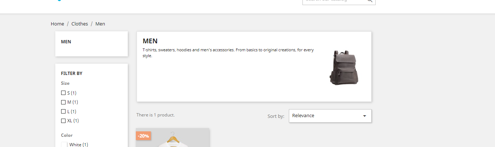
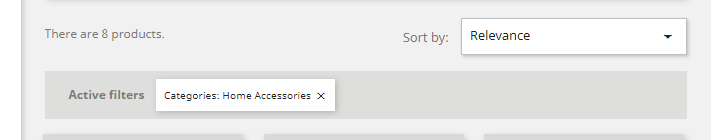
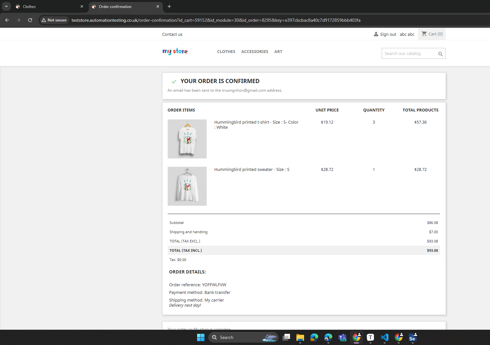

## **Test case 1: Authentication Flow:**

1. Navigate to http://teststore.automationtesting.co.uk/
2. Enter invalid email and incorrect password.
3. Click "Login" and verify the unsuccessful login.
4. Ensure the page stays on the login screen.
5. Enter valid email and password.
6. Click "Login" and verify the successful login.
7. Confirm redirection to the "My Account" page.
8. On the "My Account" page, click "Logout" and verify successful logout.

---

## **Test case: Search and filter flow:**

1. Navigate to http://teststore.automationtesting.co.uk/
2. Enter search `HUMMINGBIRD PRINTED` 
3. Verify return  **Kiểm Tra Tất Cả Các Kết Quả Có Chứa Từ Khóa Tìm Kiếm:**

---

## test case: filter

1. truy cập http://teststore.automationtesting.co.uk/3-clothes
2. Sắp xếp theo giá thấp đến cao: Chọn tùy chọn sắp xếp giá thấp đến cao trên trang tìm kiếm.
3. Lấy danh sách sản phẩm đã sắp xếp: Lấy danh sách sản phẩm sau khi đã sắp xếp theo giá.
4. **Kiểm Tra Tăng Giá:**
   - Thực hiện một vòng lặp while để kiểm tra xem giá của sản phẩm thứ "i" có tăng dần không.

---

## **Test case: Search not found product:**

1. Navigate to http://teststore.automationtesting.co.uk/
2. Enter search `nhon dep trai` 
3. Verify return  Sorry for the inconvenience

---

## **Tên Test Case:** Kiểm thử bộ lọc sản phẩm trên trang web

1. Navigate to http://teststore.automationtesting.co.uk/6-accessories
2. Click  `Home Accessories` (8)
3. Lấy Tổng Số Lượng Sản Phẩm Trên Trang:
4. Xác minh rằng số lượng sản phẩm sau khi áp dụng bộ lọc đúng như số lượng sản phẩm trên trang.

---

## **Tên Test Case:** Kiểm thử bộ lọc sản phẩm trên trang web và filter

1. Navigate to http://teststore.automationtesting.co.uk/6-accessories
2. Click  `Home Accessories` (8)
3. **Lấy Tổng Số Lượng Sản Phẩm Trên Trang:*
4. Xác minh rằng số lượng sản phẩm sau khi áp dụng bộ lọc đúng như số lượng sản phẩm trên trang.
5. Sắp xếp theo giá thấp đến cao: Chọn tùy chọn sắp xếp giá thấp đến cao trên trang tìm kiếm.
6. Lấy danh sách sản phẩm đã sắp xếp: Lấy danh sách sản phẩm sau khi đã sắp xếp theo giá.

---

## kiểm thử chọn loại sản phẩm

1. truy cập http://teststore.automationtesting.co.uk/3-clothes
2. chọn men 
3. Kiểm tra 

---

## **Tên Test Case:** Kiểm thử clear filter

1. Navigate to http://teststore.automationtesting.co.uk/6-accessories
2. Click  `Home Accessories` (8) & 
3. Click clear all button
4. Kiểm tra active filter mất or check số lượng sản phẩm

---

## **Tên  Test Case:** Chọn  1 loại sản phẩm, tăng kích thước, thêm vào giỏ hàng

1. **Truy  Cập:** http://teststore.automationtesting.co.uk/
2. scoll on product and click quick view 
3. **Chọn  loại sản phẩm:**  Chọn loại của sản phẩm trên trang sản phẩm.  
4. **Tăng  kích thước:** Tăng  kích thước sản phẩm (ví dụ: 60x90cm).  
5. kiểm tra kích thước bằng với kích thước hiển thị trên giỏ hàng

## **Tên  Test Case:** Chọn  1 loại sản phẩm, tăng số lượng, thêm vào giỏ hàng

1. **Truy  Cập:** http://teststore.automationtesting.co.uk/
2. scoll on product and click quick view 
3. **Chọn  loại sản phẩm:**  Chọn loại của sản phẩm trên trang sản phẩm.  
4. tăng số lượng +1
5. **Thêm  vào giỏ hàng:** Nhấn  nút "Thêm vào giỏ hàng" sau khi đã chọn biến thể và tăng kích thước.  
6. Click button giỏ hàng
7. kiểm tra số lượng sản phẩm có đúng == 2

---

## **Tên  Test Case:** Chọn  nhiều loại sản phẩm, thêm vào giỏ hàng

1. **Truy  Cập:** http://teststore.automationtesting.co.uk/
2. scoll on product and click quick view 
3. **Chọn  loại sản phẩm:**  Chọn loại của sản phẩm trên trang sản phẩm.  
4. Thêm một sản phẩm khác
5. Click button giỏ hàng
6. kiểm tra số lượng sản phẩm có đúng == 2

---

## **Tên  Test Case:** xóa sản phẩm trong giỏ hàng

1. **Truy  Cập:** http://teststore.automationtesting.co.uk/
2. scoll on product and click quick view 
3. **Chọn  loại sản phẩm:**  Chọn loại của sản phẩm trên trang sản phẩm.  
4. **Tăng  kích thước:** Tăng  kích thước sản phẩm (ví dụ: 60x90cm).  
5. **Thêm  vào giỏ hàng:** Nhấn  nút "Thêm vào giỏ hàng" sau khi đã chọn biến thể và tăng kích thước.  
6. Click button giỏ hàng
7. xóa sản phẩm trong giỏ hàng
8. kiểm tra số lượng sản phẩm có đúng == 0

---

## tăng và giảm số lượng sản phẩm trong giỏ hàng kiểm tra số tiền

---

##   ~~**Tên  Test Case:** Thêm  mã khuyến mãi khi ở trang giỏ hàng và nhận giảm giá~~  

1. ~~**Truy  Cập:** http://teststore.automationtesting.co.uk/cart~~  
2. ~~**Nhập  mã khuyến mãi:**  Nhập mã khuyến mãi hợp lệ vào trường tương ứng trên trang giỏ hàng.~~  
3. ~~**Nhận  giảm giá:** Xác nhận  giảm giá sau khi nhập mã khuyến mãi và lấy giá trị tổng giá trị mới.~~  

---

## **Tên  Test Case:** Kiểm thử lọc sản phẩm theo khuyến mãi 

1. truy cập http://teststore.automationtesting.co.uk/prices-drop
2. **Kiểm Tra Sản Phẩm Hiển Thị Có Khuyến Mãi:**
   - Sử dụng vòng lặp để kiểm tra từng sản phẩm trong danh sách và đảm bảo rằng chúng có thông báo khuyến mãi.

---

## Kiểm thử đặt hàng

1. truy cập web
2. click giỏ hàng
3. click thanh toán
4. điền thông tin address, payment (option 2)
5. kiểm trả số lượng sản phẩm đúng

## Thêm giỏ hàng tiếp tục mua hàng không thanh toán

## Thay đổi thông tin cá nhân

1. http://teststore.automationtesting.co.uk/identity
2. đổi thông tin
3. save
4. check sau khi reload ten đã update

## Cập nhật địa chỉ

## thêm địa chỉ

## 
