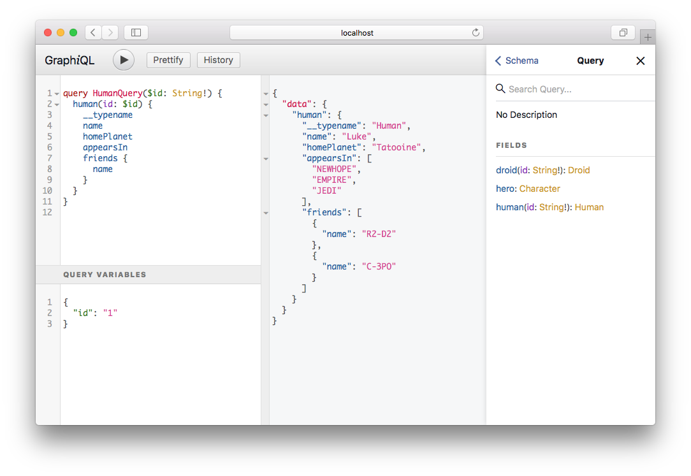

## Introduction

GraphQL is a query language for your API, and a server-side runtime for executing queries by using a type system you define for your data. GraphQL isn't tied to any specific database or storage engine and is instead backed by your existing code and data.

A GraphQL service is created by defining types and fields on those types, then providing functions for each field on each type.

## Installation

For the core library and execution engine:

```bash
dotnet add package GraphQL
```

## Tools

### GraphiQL

[GraphiQL](https://github.com/graphql/graphiql) is an interactive in-browser GraphQL IDE.
This is a fantastic developer tool to help you form queries and explore your Schema.



The easiest way to add GraphiQL into your ASP.NET Core app is to use the
[GraphQL.Server.Ui.GraphiQL](https://www.nuget.org/packages/GraphQL.Server.Ui.GraphiQL) package.
All you need to do after installing nuget is to append one extra line in your `Startup.cs`:

```csharp
public void Configure(IApplicationBuilder app, IHostingEnvironment env)
{
    app.UseGraphQLGraphiQL();
}
```

If you do not explicitly specify an endpoints through the optional `options` argument then
GraphiQL by default will run on `/ui/graphiql` endpoint and will send requests to `/graphql`
GraphQL API endpoint.

## Queries

To perform a query you need to have a root Query object that is an `ObjectGraphType`.
Queries should only fetch data and never modify it.  You can only have a single root
Query object. By default queries are executed in parallel.

```graphql
query {
  hero {
    id
    name
  }
}
```

If you have only a single query, you can use shorthand syntax.

```graphql
hero {
  id
  name
}
```

To provide an `Operation` name for your query, you add it after the `query` keyword.
An `Operation` name is optional if there is only a single operation in the request.

```graphql
query MyHeroQuery {
  hero {
    id
    name
  }
}
```

You can also provide that operation name to the `ExecutionOptions`.

```csharp
var schema = new Schema { Query = new StarWarsQuery() };
var json = await schema.ExecuteAsync(_ =>
{
  _.OperationName = "MyHeroQuery";
  _.Query = @"
    query MyHeroQuery {
      hero {
        id
        name
      }
    }
  ";
});
```

```csharp
public class StarWarsQuery : ObjectGraphType
{
  public StarWarsQuery()
  {
    Field<DroidType>("hero")
      .Resolve(context => new Droid { Id = "1", Name = "R2-D2" });
  }
}
```

## Lists and Non-Null

Object types, scalars, and enums are the only kinds of types you can define in GraphQL.
But when you use the types in other parts of the schema, or in your query variable
declarations, you can apply additional _type modifiers_ that affect validation of those
values. Let's look at an example:

```graphql
type Character {
  name: String!
  appearsIn: [Episode]!
}
```

Here, we're using a `String` type and marking it as _Non-Null_ by adding an exclamation
mark, `!` after the type name. This means that our server always expects to return a
non-null value for this field, and if it ends up getting a null value that will actually
trigger a GraphQL execution error, letting the client know that something has gone wrong.

The Non-Null type modifier can also be used when defining arguments for a field, which
will cause the GraphQL server to return a validation error if a null value is passed as
that argument, whether in the GraphQL string or in the variables.

```graphql
query DroidById($id: ID!) {
  droid(id: $id) {
    name
  }
}
```

Lists work in a similar way: We can use a type modifier to mark a type as a `List`, which
indicates that this field will return an array of that type. In the schema language, this
is denoted by wrapping the type in square brackets, `[` and `]`. It works the same for
arguments, where the validation step will expect an array for that value.

The Non-Null and List modifiers can be combined. For example, you can have a List of Non-Null Strings:

```graphql
myField: [String!]
```

This means that the _list itself_ can be null, but it can't have any null members. For example, in JSON:

```js
myField: null // valid
myField: [] // valid
myField: ['a', 'b'] // valid
myField: ['a', null, 'b'] // error
```

Now, let's say we defined a Non-Null List of Strings:

```graphql
myField: [String]!
```

This means that the list itself cannot be null, but it can contain null values:

```js
myField: null // error
myField: [] // valid
myField: ['a', 'b'] // valid
myField: ['a', null, 'b'] // valid
```

You can arbitrarily nest any number of Non-Null and List modifiers, according to your needs.

## Arguments

You can provide arguments to a field.  You can use `GetArgument` on `IResolveFieldContext` to retrieve argument values.  `GetArgument` will attempt to coerce the argument values to the generic type it is given, including primitive values, objects, and enumerations.  You can gain access to the value directly through the `Arguments` dictionary on `IResolveFieldContext`.

```graphql
query {
  droid(id: "123") {
    id
    name
  }
}
```

### Schema First

```csharp
public class Droid
{
  public string Id { get; set; }
  public string Name { get; set; }
}

public class Query
{
  private List<Droid> _droids = new List<Droid>
  {
    new Droid { Id = "123", Name = "R2-D2" }
  };

  [GraphQLMetadata("droid")]
  public Droid GetDroid(string id)
  {
    return _droids.FirstOrDefault(x => x.Id == id);
  }
}

var schema = Schema.For(@"
  type Droid {
    id: ID!
    name: String
  }

  type Query {
    droid(id: ID!): Droid
  }
", _ => {
    _.Types.Include<Query>();
});

var json = await schema.ExecuteAsync(_ =>
{
  _.Query = $"{{ droid(id: \"123\") {{ id name }} }}";
});
```

### GraphType First

```csharp
public class Droid
{
  public string Id { get; set; }
  public string Name { get; set; }
}

public class DroidType : ObjectGraphType
{
  public DroidType()
  {
    Field<NonNullGraphType<IdGraphType>>("id");
    Field<StringGraphType>("name");
  }
}

public class StarWarsQuery : ObjectGraphType
{
  private List<Droid> _droids = new List<Droid>
  {
    new Droid { Id = "123", Name = "R2-D2" }
  };

  public StarWarsQuery()
  {
    Field<DroidType>("droid")
      .Argument<IdGraphType>("id")
      .Resolve(context =>
      {
        var id = context.GetArgument<string>("id");
        return _droids.FirstOrDefault(x => x.Id == id);
      });
  }
}

var schema = new Schema { Query = new StarWarsQuery() };
var json = await schema.ExecuteAsync(_ =>
{
  _.Query = $"{{ droid(id: \"123\") {{ id name }} }}";
})
```

## Aliases

You can provide an alias for a queried field and rename it to anything you want.

```graphql
{
  empireHero: hero(id: "1") {
    name
  }
  jediHero: hero(id: "2") {
    name
  }
}
```

## Fragments

Fragments let you construct sets of fields and then include them in queries where you need to.

```graphql
query {
  leftComparison: hero(id: "1") {
    ...comparisonFields
  }
  rightComparison: hero(id: "2") {
    ...comparisonFields
  }
}

fragment comparisonFields on Character {
  name
  appearsIn
  friends {
    name
  }
}
```

## Variables

You can pass variables received from the client to the execution engine by using the `Variables` property.

> See the [official GraphQL documentation on variables](http://graphql.org/learn/queries/#variables)

Here is what a query looks like with a variable:

```graphql
query DroidQuery($droidId: String!) {
  droid(id: $droidId) {
    id
    name
  }
}
```

Here is what this query would look like as a JSON request:

```json
{
 "query": "query DroidQuery($droidId: String!) { droid(id: $droidId) { id name } }",
 "variables": {
   "droidId": "1"
 }
}
```

Call `.Deserialize<GraphQLRequest>()` to parse a JSON request to provide it to the `DocumentExecuter`:

```csharp
var requestJson = /* request as shown above */;
var request = new GraphQLSerializer().Deserialize<GraphQLRequest>(requestJson);

var result = await schema.ExecuteAsync(options =>
{
  options.Query = request.Query;
  options.OperationName = request.OperationName;
  options.Variables = request.Variables;
  options.Extensions = request.Extensions;
});
```

If you need to parse the variables separately from the query, you can call `.Deserialize<Inputs>()` to parse
a JSON-formatted variables string to an `Inputs` class suitable for passing to the `DocumentExecuter`:

```csharp
var variablesJson = /* get from request */;
var inputs = new GraphQLSerializer().Deserialize<Inputs>(variablesJson);

await schema.ExecuteAsync(options =>
{
  options.Query = "...";
  options.Variables = inputs;
});
```

Please note that you will need either the `GraphQL.SystemTextJson` or `GraphQL.NewtonsoftJson` nuget package
to run the above code, with the appropriate `using` statement.

When using dependency injection, you will typically register the serializer via `.AddSystemTextJson()` or
`.AddNewtonsoftJson()` in your DI configuration code, and then pull in instances of `IGraphQLTextSerializer`,
`ISchema` and `IDocumentExecuter`, resulting with code more similar to the following:

```csharp
Task<string> ExecuteAsync(string request, CancellationToken cancellationToken = default)
{
  var request = _serializer.Deserialize<GraphQLRequest>(request);
  var result = await _documentExecuter.ExecuteAsync(options =>
  {
    options.Schema = _schema;
    options.Query = request.Query;
    options.OperationName = request.OperationName;
    options.Variables = request.Variables;
    options.Extensions = request.Extensions;
    options.CancellationToken = cancellationToken;
  });
  var response = _serializer.Serialize(result);
  return response;
}
```

You can also use the `.Read<T>()` and `.Write()` methods of the serializer for `Stream`-based asynchronous
serialization and deserialization.

## Directives

A directive can be attached to almost every part of the schema - field, query, enum, fragment inclusion etc. and can affect execution
of the query in any way the server desires. The core GraphQL [specification](https://spec.graphql.org/October2021/#sec-Type-System.Directives)
includes exactly four directives.

- `@include(if: Boolean!) on FIELD | FRAGMENT_SPREAD | INLINE_FRAGMENT` Only include this field in the result if the argument is true.
- `@skip(if: Boolean!) on FIELD | FRAGMENT_SPREAD | INLINE_FRAGMENT` Skip this field if the argument is true.
- `@deprecated(reason: String = "No longer supported") on FIELD_DEFINITION | ENUM_VALUE` Indicates deprecated portions of a GraphQL service’s schema, such as deprecated fields on a type or deprecated enum values.
- `@specifiedBy(url: String!) on SCALAR` Provides a scalar specification URL for specifying the behavior of custom scalar types.

```graphql
query HeroQuery($id: ID, $withFriends: Boolean!) {
  hero(id: $id) {
    name
    friends @include(if: $withFriends) {
      name
    }
  }
}
```

## Mutations

To perform a mutation you need to have a root Mutation object that is an `ObjectGraphType`.
Mutations make modifications to data and return a result. You can only have a single root
Mutation object. By default according to specification mutations are executed serially.

> See the [official GraphQL documentation on mutations](http://graphql.org/learn/queries/#mutations).

Instead of using the `query` keyword, you are required to use `mutation`. Similar to a
`query`, you can omit the `Operation` name if there is only a single operation in the request.

```graphql
mutation ($human:HumanInput!) {
  createHuman(human: $human) {
    id
    name
  }
}
```

The JSON request for this mutation would look like:

```json
{
  "query": "mutation ($human:HumanInput!){ createHuman(human: $human) { id name } }",
  "variables": {
    "human": {
      "name": "Boba Fett",
      "homePlanet": "Kamino"
    }
  }
}
```

C# class would look like:

```csharp
public class Human
{
    public string Name { get; set; }
    public string HomePlanet { get; set; }
}
```

Set the `Mutation` property on your `Schema`.

```csharp
public class StarWarsSchema : Schema
{
  public StarWarsSchema(IServiceProvider provider)
    : base(provider)
  {
    Query = provider.Resolve<StarWarsQuery>();
    Mutation = provider.Resolve<StarWarsMutation>();
  }
}
```

A `mutation` `GraphType` looks identical to a `query` `GraphType`. The difference is you are allowed to mutate data.

```csharp
public class StarWarsMutation : ObjectGraphType
{
  public StarWarsMutation(StarWarsData data)
  {
    Field<HumanType>("createHuman")
      .Argument<NonNullGraphType<HumanInputType>>("human")
      .Resolve(context =>
      {
        var human = context.GetArgument<Human>("human");
        return data.AddHuman(human);
      });
  }
}
```

To provide a set of input values you must use `InputObjectGraphType`.

```csharp
public class HumanInputType : InputObjectGraphType
{
  public HumanInputType()
  {
    Name = "HumanInput";
    Field<NonNullGraphType<StringGraphType>>("name");
    Field<StringGraphType>("homePlanet");
  }
}
```

`StarWarsData` is an in-memory data store.

```csharp
public class StarWarsData
{
  private List<Human> _humans = new List<Human>();

  public Human AddHuman(Human human)
  {
    human.Id = Guid.NewGuid().ToString();
    _humans.Add(human);
    return human;
  }
}
```

> See the [StarWars example](https://github.com/graphql-dotnet/examples/tree/master/src/StarWars) for a full implementation.

## Unions

Unions are a composition of two or more different types. To create such union type,
you need to inherit from `UnionGraphType` and call the `Type<TType>` method on
the all types that you want to include in this union.

```csharp
public class CatOrDog : UnionGraphType
{
  public CatOrDog()
  {
    Type<Cat>();
    Type<Dog>();
  }
}

public class Cat : ObjectGraphType<CatModel>
{
  public Cat()
  {
    Field<StringGraphType>("name");
    Field<BooleanGraphType>("meows");
  }
}

public class Dog : ObjectGraphType<DogModel>
{
  public Dog()
  {
    Field<StringGraphType>("name");
    Field<BooleanGraphType>("barks");
  }
}
```

In this example `CatOrDog` type should implement `ResolveType` or both `Cat` and
`Dog` types should implement `IsTypeOf`. Note that `IsTypeOf` is already implemented
for `ObjectGraphType<TSourceType>` so in this example `ResolveType` is not used.
For details about `IsTypeOf` and `ResolveType` see [Interfaces](../interfaces).

## Subscriptions

Subscriptions are supported through the use of `IObservable<T>`. You will need a server that
supports a Subscription protocol.  The [GraphQL Server](https://github.com/graphql-dotnet/server/)
project provides a .NET Core server that implements the Apollo GraphQL subscription protocol.
See the [GraphQL Server project samples](https://github.com/graphql-dotnet/server/tree/develop/samples).

Instead of using the `query` or `mutation` keyword you are required to use `subscription`.
Similar to a `query` and `mutation`, you can omit the `Operation` name if there is only a
single operation in the request.

```graphql
subscription MessageAdded {
  messageAdded {
    from {
      id
      displayName
    }
    content
    sentAt
  }
}
```

```csharp
public class ChatSubscriptions : ObjectGraphType
{
  private readonly IChat _chat;

  public ChatSubscriptions(IChat chat)
  {
    _chat = chat;

    Field<MessageType, Message>("messageAdded")
      .ResolveStream(ResolveStream);
  }

  private IObservable<Message> ResolveStream(IResolveFieldContext context)
  {
    return _chat.Messages();
  }
}
```

### IGraphQLSerializer & IGraphQLTextSerializer

Serialize and deserialize object hierarchies to/from a `Stream` and `string` respectively. Should include special support for `ExecutionResult` , `Inputs` and transport-specific classes as necessary. GraphQL.NET provides `Newtonsoft.Json` and `System.Text.Json` as default implementations of these interfaces.

Simple example of `System.Text.Json` serializer in an ASP.Net Core controller is shown below:

*Program.cs*

```csharp
builder.Services.AddGraphQL(options =>
    {
        options.AddSystemTextJson();
        options.AddSchema<FooSchema>();
    });
```

*Controller.cs*

```csharp
public GraphQLController(ISchema schema, IDocumentExecuter executer, IGraphQLTextSerializer serializer)
    {
        _schema = schema;
        _executer = executer;
        _serializer = serializer;
    }

[HttpPost]
public async Task<IActionResult> Post([FromBody] GraphQLRequest query)
    {
        var result = await _executer.ExecuteAsync(options =>
            {
                options.Schema = _schema;
                options.Query = query.Query;
            }).ConfigureAwait(false);
        Response.StatusCode = (int)(result.Executed ? HttpStatusCode.OK : HttpStatusCode.BadRequest);
        return Content(_serializer.Serialize(result), "application/graphql-response+json", System.Text.Encoding.UTF8);
    }
```

## Query Validation

There [are a number of query validation rules](https://spec.graphql.org/October2021/#sec-Validation)
that are ran when a query is executed. All of these are turned on by default. You can add your own validation
rules or clear out the existing ones by setting the `ValidationRules` property.

```csharp
await schema.ExecuteAsync(_ =>
{
  _.Query = "...";
  _.ValidationRules =
    new[]
    {
      new RequiresAuthValidationRule()
    }
    .Concat(DocumentValidator.CoreRules);
});
```

## Query Organization

In GraphQL there is only a single root `Query` object. This can make your root objects bloat
with unrelated functionality. You can group sets of functionality by adding a top level group.
You can apply this same trick to mutations and subscriptions.

```graphql
type Query {
  customer(id: ID): Customer
  order(id: ID): Order
  products: [Product]
}
```

```csharp
public class Query : ObjectGraphType
{
  public Query()
  {
    Name = "Query";
    Field<CustomerGraphType>("customer").Arguments(...).Resolve(...);
    Field<OrderGraphType>("order").Arguments(...).Resolve(...);
    Field<ListGraphType<ProductGraphType>>("products").Arguments(...).Resolve(...);
  }
}
```

Split into groups.

```graphql
type Account {
  customer(id: ID): Customer
  order(id: ID): Order
}

type Retail {
  products: [Product]
}

type Query {
  account: Account
  retail: Retail
}
```

The trick is to return an empty object.

```csharp
public class Query : ObjectGraphType
{
  public Query()
  {
    Name = "Query";
    Field<AccountGroupGraphType>("account").Resolve(context => new {});
    Field<RetailGroupGraphType>("retail").Resolve(context => new {});
  }
}

public class AccountGroupGraphType : ObjectGraphType
{
  public AccountGroupGraphType()
  {
    Name = "Account";
    Field<CustomerGraphType>("customer").Arguments(...).Resolve(...);
    Field<OrderGraphType>("order").Arguments(...).Resolve(...);
  }
}

public class RetailGroupGraphType : ObjectGraphType
{
  public RetailGroupGraphType()
  {
    Name = "Retail";
    Field<ListGraphType<ProductGraphType>>("products").Arguments(...).Resolve(...);
  }
}
```

This allows you to separate out your queries into separate source files to keep your code
base cleaner. However, it will mean that your queries are 'nested' a layer deeper than
before, and you will need to take this into account when querying. For example, the above
'Retail' example, which could be queried in the playground with:

```graphql
{
  products {
    name
  }
}
```

Will now require

```graphql
{
  retail {
    products {
      name
    }
  }
}
```

## User Context

You can pass a `UserContext` (any `IDictionary<string, object?>`) to provide access to
your specific data. The `UserContext` is accessible in field resolvers and validation rules.

```csharp
public class MyGraphQLUserContext : Dictionary<string, object?>
{
}

await schema.ExecuteAsync(_ =>
{
  _.Query = "...";
  _.UserContext = new MyGraphQLUserContext();
});

public class Query : ObjectGraphType
{
  public Query()
  {
    Field<DroidType>("hero")
      .Resolve(context =>
      {
        var userContext = context.UserContext as MyGraphQLUserContext;
        ...
      });
  }
}
```

If you need to access the User from the http request and populate this in validation rules you may need to add a User property to your custom `UserContext` class and modify your Startup configuration as follows:

```csharp
  public class MyGraphQLUserContext : Dictionary<string, object?>
  {
      public ClaimsPrincipal User { get; set; }

      public MyGraphQLUserContext(ClaimsPrincipal user)
      {
          User = user;
      }
  }

  services.AddGraphQL()
          .AddUserContextBuilder(httpContext => new MyGraphQLUserContext(httpContext.User));
```

## Dependency Injection

GraphQL.NET supports dependency injection through a `IServiceProvider` interface that is passed to the Schema class. Internally when trying to resolve a type the library will call the methods on this interface.

> The library resolves a `GraphType` only once and caches that type for the lifetime of the `Schema`.

The default implementation of `IServiceProvider` uses `Activator.CreateInstance`. `Activator.CreateInstance` requires that an object have a public parameterless constructor.

```csharp
public sealed class DefaultServiceProvider : IServiceProvider
{
    public object GetService(Type serviceType)
    {
        if (serviceType == null)
            throw new ArgumentNullException(nameof(serviceType));

        try
        {
            return Activator.CreateInstance(serviceType);
        }
        catch (Exception exception)
        {
            throw new Exception($"Failed to call Activator.CreateInstance. Type: {serviceType.FullName}", exception);
        }
    }
}
```

You can override the default implementation by passing a `IServiceProvider` to the constructor of your `Schema`.

```csharp
public class StarWarsSchema : GraphQL.Types.Schema
{
    public StarWarsSchema(IServiceProvider provider, StarWarsQuery query, StarWarsMutation mutation)
        : base(provider)
    {
        Query = query;
        Mutation = mutation;
    }
}
```

How you integrate this into your system will depend on the dependency injection framework you are using. `FuncServiceProvider` is provided for easy integration with multiple containers.

### Dependency Injection Registration Helpers

GraphQL.NET provides an `IGraphQLBuilder` interface which encapsulates the configuration methods of a dependency injection framework, to provide an
abstract method of configuring a dependency injection framework to work with GraphQL.NET. This interface is provided through a configuration delegate
from a DI-provider-specific setup method (typically called `AddGraphQL()`), at which point you can call extension methods on the interface to
configure this library. A simple example is below:

```csharp
services.AddGraphQL(builder => builder
    .AddSystemTextJson()
    .AddSchema<MySchema>());
```

The interface also allows configuration of the schema during initialization, and configuration of the execution at runtime. In this manner, adding
middleware, for example, is as simple as calling `.AddMiddleware<MyMiddlware>()` and does not require the middleware to be added into the schema
configuration.

### ASP.NET Core

[See this example.](https://github.com/graphql-dotnet/examples/blob/8d5b7544006902f45b818010585b1ffa86ef446b/src/AspNetCoreCustom/Example/Startup.cs#L16-L34)

`Microsoft.Extensions.DependencyInjection` package used in ASP.NET Core already has support for resolving `IServiceProvider` interface so no additional settings are required - just add your required dependencies:

```csharp
public void ConfigureServices(IServiceCollection services)
{
    services.AddSingleton<IDocumentExecuter, DocumentExecuter>();
    services.AddSingleton<IGraphQLSerializer, GraphQLSerializer>();
    services.AddSingleton<StarWarsData>();
    services.AddSingleton<StarWarsQuery>();
    services.AddSingleton<StarWarsMutation>();
    services.AddSingleton<HumanType>();
    services.AddSingleton<HumanInputType>();
    services.AddSingleton<DroidType>();
    services.AddSingleton<CharacterInterface>();
    services.AddSingleton<EpisodeEnum>();
    services.AddSingleton<ISchema, StarWarsSchema>();
}
```

To avoid having to register all of the individual graph types in your project, you can
import the [GraphQL.MicrosoftDI NuGet package](https://www.nuget.org/packages/GraphQL.MicrosoftDI)
package and utilize the `SelfActivatingServiceProvider` wrapper as follows:

```csharp
public void ConfigureServices(IServiceCollection services)
{
    services.AddSingleton<ISchema, StarWarsSchema>(services => new StarWarsSchema(new SelfActivatingServiceProvider(services)));
}
```

If you previously pulled in your query, mutation and/or subscription classes via dependency injection, you will need
to manually pull in those dependencies from the `SelfActivatingServiceProvider` via `GetRequiredService` as follows:

```csharp
public class StarWarsSchema : Schema
{
    public StarWarsSchema(IServiceProvider serviceProvider) : base(serviceProvider)
    {
        Query = serviceProvider.GetRequiredService<StarWarsQuery>();
        Mutation = serviceProvider.GetRequiredService<StarWarsMutation>();
    }
}
```

No other graph types will need to be registered. Graph types will only be instantiated once, during schema initialization
as usual. Graph types can also pull in any services registered with dependency injection as usual.

Note that if any of the graph types directly or indirectly implement `IDisposable`, be sure to register those types with your dependency
injection provider, or their `Dispose` methods will not be called. Any dependencies of graph types that implement
`IDisposable` will be disposed of properly, regardless of whether the graph type is registered within the service provider.

You can also use the `.AddGraphTypes()` builder method to scan the calling or specified assembly for classes that implement
`IGraphType` and register them all as transients within the service provider. Mark your class with `DoNotRegisterAttribute` if you
want to skip registration.