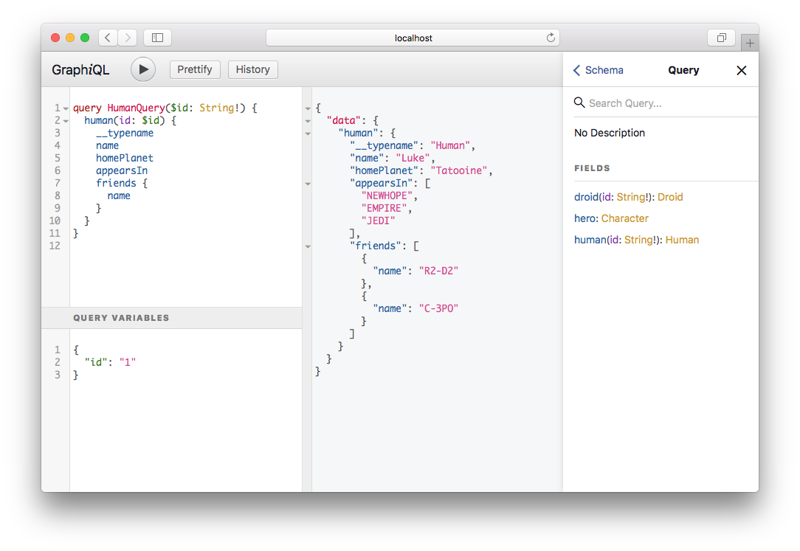

## Introduction

GraphQL is a query language for your API, and a server-side runtime for executing queries by using a type system you define for your data. GraphQL isn't tied to any specific database or storage engine and is instead backed by your existing code and data.

A GraphQL service is created by defining types and fields on those types, then providing functions for each field on each type.

## Installation

For the core library and execution engine:
```bash
dotnet add package GraphQL
```

## Tools

### GraphiQL

[GraphiQL](https://github.com/graphql/graphiql) is an interactive in-browser GraphQL IDE.
This is a fantastic developer tool to help you form queries and explore your Schema.



The easiest way to add GraphiQL into your ASP.NET Core app is to use the
[GraphQL.Server.Ui.GraphiQL](https://www.nuget.org/packages/GraphQL.Server.Ui.GraphiQL) package.
All you need to do after installing nuget is to append one extra line in your `Startup.cs`:

```csharp
public void Configure(IApplicationBuilder app, IHostingEnvironment env)
{
    app.UseGraphQLGraphiQL();
}
```

If you do not explicitly specify an endpoints through the optional `options` argument then
GraphiQL by default will run on `/ui/graphiql` endpoint and will send requests to `/graphql`
GraphQL API endpoint.

### Altair GraphQL Client

[Altair GraphQL Client](https://altair.sirmuel.design/) is a beautiful feature-rich GraphQL Client IDE that enables you interact with any GraphQL server you are authorized to access from any platform you are on.
You can easily test and optimize your GraphQL implementations. You also have several features to make your GraphQL development process much easier including subscriptions, query scaffolding, formatting, multiple languages, themes, and many more.


The easiest way to add Altair into your ASP.NET Core app is to use the [GraphQL.Server.Ui.Altair](https://www.nuget.org/packages/GraphQL.Server.Ui.Altair) package.
All you need to do after installing nuget is to append one extra line in your `Startup.cs`:
```c#
public void Configure(IApplicationBuilder app, IHostingEnvironment env)
{
    app.UseGraphQLAltair();
}
```
If you do not explicitly specify an endpoints through the optional `options` argument then
Altair by default will run on `/ui/altair` endpoint and will send requests to `/graphql`
GraphQL API endpoint.


## Queries

To perform a query you need to have a root Query object that is an `ObjectGraphType`.
Queries should only fetch data and never modify it.  You can only have a single root
Query object. By default queries are executed in parallel.

```graphql
query {
  hero {
    id
    name
  }
}
```

If you have only a single query, you can use shorthand syntax.

```graphql
hero {
  id
  name
}
```

To provide an `Operation` name for your query, you add it after the `query` keyword.
An `Operation` name is optional if there is only a single operation in the request.

```graphql
query MyHeroQuery {
  hero {
    id
    name
  }
}
```

You can also provide that operation name to the `ExecutionOptions`.

```csharp
var schema = new Schema { Query = new StarWarsQuery() };
var json = await schema.ExecuteAsync(_ =>
{
  _.OperationName = "MyHeroQuery";
  _.Query = @"
    query MyHeroQuery {
      hero {
        id
        name
      }
    }
  ";
});
```

```csharp
public class StarWarsQuery : ObjectGraphType
{
  public StarWarsQuery()
  {
    Field<DroidType>("hero")
      .Resolve(context => new Droid { Id = "1", Name = "R2-D2" });
  }
}
```

## Schema Types

### Scalars

A GraphQL object type has a name and fields, but at some point those fields have to resolve
to some concrete data. That's where the scalar types come in: they represent the leaves of the query.

These are the scalars provided by the [GraphQL Specification](https://spec.graphql.org/October2021/#sec-Scalars).

| GraphQL   | GraphQL.NET        | .NET                    |
| --------- | ------------------ | ----------------------- |
| `String`  | `StringGraphType`  | `string`                |
| `Int`     | `IntGraphType`     | `int`                   |
| `Float`   | `FloatGraphType`   | `double`                |
| `Boolean` | `BooleanGraphType` | `bool`                  |
| `ID`      | `IdGraphType`      | `int`, `long`, `string` |

> Note that you can use a `Guid` with `ID`.  It will just be serialized to a `string` and
> should be sent to your GraphQL Server as a `string`.

These are additional scalars provided by this project.

| GraphQL          | GraphQL.NET                     | .NET             | Format                     | Remarks          |
| ---------------- | ------------------------------- | ---------------- | -------------------------- | ---------------- |
| `BigInt`         | `BigIntGraphType`               | `BigInteger`     | number                     |                  |
| `Byte`           | `ByteGraphType`                 | `byte`           | number                     |                  |
| `Date`           | `DateGraphType`                 | `DateTime`       | ISO-8601: yyyy-MM-dd       |                  |
| `DateOnly`       | `DateOnlyGraphType`             | `DateOnly`       | ISO-8601: yyyy-MM-dd       | .NET6 and higher |
| `DateTime`       | `DateTimeGraphType`             | `DateTime`       | ISO-8601, assume UTC       |                  |
| `DateTimeOffset` | `DateTimeOffsetGraphType`       | `DateTimeOffset` | ISO-8601                   |                  |
| `Decimal`        | `DecimalGraphType`              | `decimal`        | number                     |                  |
| `Guid`           | `GuidGraphType`                 | `Guid`           | string                     |                  |
| `Half`           | `HalfGraphType`                 | `Half`           | number                     | .NET5 and higher |
| `Long`           | `LongGraphType`                 | `long`           | number                     |                  |
| `Milliseconds`   | `TimeSpanMillisecondsGraphType` | `TimeSpan`       | number                     |                  |
| `SByte`          | `SByteGraphType`                | `sbyte`          | number                     |                  |
| `Seconds`        | `TimeSpanSecondsGraphType`      | `TimeSpan`       | number                     |                  |
| `Short`          | `ShortGraphType`                | `short`          | number                     |                  |
| `TimeOnly`       | `TimeOnlyGraphType`             | `TimeOnly`       | ISO-8601: HH:mm:ss.FFFFFFF | .NET6 and higher |
| `UInt`           | `UIntGraphType`                 | `uint`           | number                     |                  |
| `ULong`          | `ULongGraphType`                | `ulong`          | number                     |                  |
| `Uri`            | `UriGraphType`                  | `Uri`            | RFC 2396/2732/3986/3987    |                  |
| `UShort`         | `UShortGraphType`               | `ushort`         | number                     |                  |

Lists of data are also supported with any Scalar or Object types.

| GraphQL     | GraphQL.NET                       | .NET           |
| ----------- | --------------------------------- | -------------- |
| `[String]`  | `ListGraphType<StringGraphType>`  | `List<string>` |
| `[Boolean]` | `ListGraphType<BooleanGraphType>` | `List<bool>`   |

### Objects

Objects are composed of scalar types and other objects.

**GraphQL**

```graphql
type Droid {
  name: String
  appearsIn: [Episode]
}
```

**GraphQL.NET**

```csharp
public class DroidType : ObjectGraphType<Droid>
{
    public DroidType()
    {
        Name = "Droid";
        Description = "A mechanical creature in the Star Wars universe.";
        Field(d => d.Name, nullable: true).Description("The name of the droid.");
        Field<ListGraphType<EpisodeEnum>>("appearsIn").Description("Which movie they appear in.");
    }
}
```

**.NET**

```csharp
public class Droid
{
  public string Name { get; set; }
  public List<Episode> AppearsIn { get; set; }
}
```

### Enumerations

Enumerations, or enums, define a finite set of discrete values. Like scalars, they represent a leaf in the query.

**GraphQL**

This enum defines the first three Star Wars films using GraphQL schema language:

```graphql
enum Episode {
  NEWHOPE
  EMPIRE
  JEDI
}
```

**.NET**

Consider the equivalent `enum` in .NET:

```csharp
public enum Episodes
{
    NEWHOPE = 4,
    EMPIRE = 5,
    JEDI = 6
}
```

Compare the two implementations. GraphQL does not specify backing values for members of its enums.
The name of each member _is_ the value.

**GraphQL.NET**

GraphQL.NET provides two methods of defining GraphQL enums.

1. You can use `EnumerationGraphType<TEnum>` to automatically generate values by providing a .NET `enum` for `TEnum`.

- The `Name` will default to the .NET type name, which you can override in the constructor.
- The `Description` will default to any `System.ComponentModel.DescriptionAttribute` applied to the enum type.
- The `DeprecationReason` will default to any `System.ObsoleteAttribute` applied to the enum type.
- Apply a `DescriptionAttribute` to an enum member to set the GraphQL `Description`.
- Apply an `ObsoleteAttribute` to an enum member to set the GraphQL `DeprecationReason`.

By default, the name of each enum member will be converted to CONSTANT_CASE. If you want to change
this behavior, you can make it in two ways.

a. Inherit from `EnumerationGraphType<TEnum>` and override `ChangeEnumCase` method.

```csharp
public class CamelCaseEnumerationGraphType<T> : EnumerationGraphType<T> where T : Enum
{
    protected override string ChangeEnumCase(string val) => val.ToCamelCase();
}
```

and then inheriting this class instead of `EnumerationGraphType`

```csharp
public class MediaTypeEnum : CamelCaseEnumerationGraphType<MediaTypeViewModel>
{
}
```

b. Mark your .NET enum with one of the `EnumCaseAttribute` descendants (`PascalCase`,  `CamelCase`, `ConstantCase`, `AsIsCase` or your own).

```csharp
[CamelCase]
public enum CamelCaseEnum
{
    FirstValue,
    SecondValue
}
```

```csharp
[Description("The Star Wars movies.")]
[Obsolete("Optional. Sets the GraphQL DeprecationReason for the whole enum.")]
public enum Episodes
{
    [Description("Episode 1: The Phantom Menace")]
    [Obsolete("Optional. Sets the GraphQL DeprecationReason for this member.")]
    PHANTOMMENACE = 1,

    [Description("Episode 4: A New Hope")]
    NEWHOPE  = 4,

    [Description("Episode 5: The Empire Strikes Back")]
    EMPIRE  = 5,

    [Description("Episode 6: Return of the Jedi")]
    JEDI  = 6
}

public class EpisodeEnum : EnumerationGraphType<Episodes>
{
}
```

When defining a field via an expression syntax as in the following example, GraphQL.NET
will automatically map enumeration types to `EnumerationGraphType<TEnum>`, unless otherwise
mapped via `Schema.RegisterTypeMapping`:

```csharp
Field(x => x.MyEnum);
```

2. You can also manually create the `EnumerationGraphType`. Advantages of this method:

- The GraphQL enum need not map to a specific .NET `enum`. You could, for instance, build the enum from one of the alternate methods of defining discrete sets of values in .NET, such as classes of constants or static properties.
- You can manually add descriptions and deprecation reasons. This may be useful if you do not control the source code for the enum.
- Backing enum values may be of any type, primitive or not.

```csharp
public class EpisodeEnum : EnumerationGraphType
{
    public EpisodeEnum()
    {
        Name = "Episode";
        Description = "One of the films in the Star Wars Trilogy.";
        Add("NEWHOPE", 4, "Released in 1977.");
        Add("EMPIRE", 5, "Released in 1980.");
        Add("JEDI", 6, "Released in 1983.");
    }
}
```

Note that although GraphQL has no use for backing values for enum members, GraphQL.NET uses
them anyway. This allows for a more natural mapping to .NET `enum`s or other collections of
constants, and avoids coupling your business logic to GraphQL semantics. The backing values
are strictly for use on the back end - the client will never see them.

**Resolving Enumerations**

Fields typed as enumerations are resolved by returning the backing value of
one of the enum members. Lists of enumerations are resolved by returning collections of enum
members. In the below examples, notice the identical implementations of the `appearsIn` field
for both human graph types. In both implementations, the client receives the GraphQL enum member
names in response to queries on the `appearsIn` field.

If the field resolves a value which cannot be mapped to one of the enum's legal values,
GraphQL.NET will trigger a [Processing Error](../errors#ProcessingErrors).

```csharp
public class HumanString
{
    //i.e. "NEWHOPE", "EMPIRE", "JEDI"
    public string[] AppearsIn { get; set; }
}

public class HumanStringType: ObjectGraphType<HumanString>
{
    public HumanStringType()
    {
        Name = "HumanString";
        Field<ListGraphType<EpisodeEnum>>("appearsIn").Description("Which movie they appear in.");
    }
}

public class HumanInt
{
    //i.e. 4, 5, 6
    public int[] AppearsIn { get; set; }
}

public class HumanIntType: ObjectGraphType<HumanInt>
{
    public HumanIntType()
    {
        Name = "HumanInt";
        Field<ListGraphType<EpisodeEnum>>("appearsIn").Description("Which movie they appear in.");
    }
}
```

**Enumeration Arguments**

Enumerations can be used as arguments in GraphQL queries. Consider a query which gets the humans appearing in a specific film:

```graphql
query HumansAppearingIn($episode: Episode!){
    humans(appearsIn: $episode){
        id
        name
        appearsIn
    }
}

# example query variables:
# {
#   "episode":"NEWHOPE"
# }
```

When GraphQL.NET receives an enum member name as a query argument, the queried field's
`ResolveFieldContext` stores the backing value associated with the enum member name
in its arguments list. The GraphQL.NET query type which handles the example query may
be implemented as:

```csharp
    public class StarWarsQuery : ObjectGraphType<object>
    {
        public StarWarsQuery()
        {
            Name = "Query";

            Field<ListGraphType<HumanType>>("humans")
                .Argument<NonNullGraphType<EpisodeEnum>>("appearsIn", "An episode the human appears in.")
                .Resolve(context => 
                {
                    // episode = 4
                    var episode = context.GetArgument<int>("appearsIn");

                    // Alternatively, get the argument as an enum. episodeFromEnum = Episodes.NEWHOPE
                    var episodeFromEnum = context.GetArgument<Episodes>("appearsIn");

                    // full implementation would access data store to get humans by episode.
                    return default(Human);
                }
            );
        }
    }
```

**Schema-First Enumeration Types**

If you have defined your schema with the schema-first syntax, the backing value of each of the enumeration
values will default to a string matching the name of the enumeration value. If you wish to use a C#
enumeration type instead, configure the type as demonstrated in one of the following examples:

```csharp
var schema = Schema.For(definitions, c =>
{
    // example 1: define the "Animal" schema enumeration type to use the C# type Animal
    c.Types.Include<Animal>();

    // example 2: define the "AnimalType" schema enumeration type to use the C# type Animal
    c.Types.Include<Animal>("AnimalType");

    // example 3: define the "Animal" schema enumeration type to use the C# type Animal
    c.Types.For("Animal").Type = typeof(Animal);
});
```

### Type Mapping

When specifying a field using the shortcut syntax `Field(x => x.Parent)`, which does not specify
a specific graph type, GraphQL.NET will first look at the data model to see if it has an `[InputType]`
or `[OutputType]` attribute specified on it indicating the graph type to use for the data model. For
instance, you can specify the graph type for a `Widget` class in the following manner:

```csharp
[InputType(typeof(WidgetInputGraphType))]
[OutputType(typeof(WidgetGraphType))]
public class Widget
{
    ...
}
```

If no attribute is specified on the type, it will search a list of CLR mappings to graph type classes.
All of the intrinsic and supplemental scalar graph types included with GraphQL.NET will be searched,
and lists are handled automatically as well.

You can also specify additional mappings during the schema initialization, which will be searched
when the schema is initialized. These mappings can be for input objects, output objects, or scalars.
A single CLR type can be mapped separately for both input and output objects.

You can override default mappings of built-in scalars by registering your own mapping.
To add a mapping, call the `RegisterTypeMapping` method on the `Schema`. Below is a sample of how
to add mappings:

```csharp
public class MySchema
{
    public void MySchema()
    {
        ...

        // For output graphs, map the 'User' data model class to the output object graph type 'UserGraphType'
        this.RegisterTypeMapping<User, UserGraphType>();

        // For input graphs, map the 'User' data model class to the input object graph type 'UserInputGraphType'
        this.RegisterTypeMapping<User, UserInputGraphType>();

        // For input or output graphs, map the 'Vector' class/struct to the scalar graph type 'VectorGraphType'
        this.RegisterTypeMapping<Vector, VectorGraphType>();

        // Override Guid default mapping to use the custom scalar graph type 'MyGuidGraphType'
        this.RegisterTypeMapping<Guid, MyGuidGraphType>()
    }
}
```

There is no limitation on the CLR type of registered mappings -- for instance, scalar graph types
can map to .NET objects or value types such as structs. However, mapping a list type such as `byte[]`
is not supported, as the GraphQL.NET infrastructure will change this into a list graph type
automatically and only search the registered mappings for a registration for `byte`.

In order to implement these type mappings, GraphQL.NET will build the field or argument using a
pseudo-type of either `GraphQLClrOutputTypeReference<T>` or `GraphQLClrInputTypeReference<T>`.
These are resolved automatically during schema initialization. If you are writing your own field
builders, you may use these pseudo-graphtype classes as placeholders for .NET-type-mapped fields
or arguments.

### Type references

If you are writing your own dynamic schema-builder or field-builder code, you may have a need to
have a placeholder graph type that is resolved during schema initialization. There are three type
reference types available for this purpose:

- `GraphQLTypeReference` can be used as a placeholder for another named graph type within the schema.
- `GraphQLClrOutputTypeReference<T>` can be used as a placeholder for a CLR-mapped output graph type.
- `GraphQLClrInputTypeReference<T>` can be used as a placeholder for a CLR-mapped input graph type.

These type references will be resolved during schema initialization. Please refer to the source
code for implementation and usage details.

## Custom Scalars

You can extend your schema with your own custom scalars. Conceptually, a scalar must implement the following operations:

- Serialization: Transforms a scalar from its server-side representation to a representation suitable for the client.

- Value Parsing: Transforms a scalar from its client-side representation as a variable to its server-side representation.

- Literal Parsing: Transforms a scalar from its client-side representation as an argument to its server-side representation.

Parsing for arguments and variables are handled separately because while arguments must always be expressed in GraphQL
query syntax, variable format is transport-specific (usually JSON). You can find more information about
these methods [here](https://github.com/graphql-dotnet/graphql-dotnet/blob/master/src/GraphQL/Types/Scalars/ScalarGraphType.cs).

You may wish to read more about how scalars work at the following links:

- <https://www.graphql-scalars.com/scalars-guide/>
- <https://www.graphql.de/blog/scalars-in-depth/>

### Vector3 sample with string parsing and serialization

The following example shows how to create a custom scalar in GraphQL.NET. You will create a 3D Vector which will be exchanged
between server and client as a comma-separated string (ex. "34, 61, 12"). The example assumes the GraphQL schema is implemented
in an ASP.NET Core project using the `Microsoft.Extensions.DependencyInjection` package, though only minor modifications would
be required for other project types.

Assume the following schema

```graphql
scalar Vector3

schema {
    query: {
        getVector: Vector3!
    }
    mutation: {
        addVector(vector3: Vector3!): Vector3
    }
}
```

The goal is to execute mutations with both arguments:

```graphql
mutation {
    addVector(vector3: "23,43,66")
}
```

and also variables:

```graphql
mutation AddVector($vector3: Vector3!) {
    addVector(vector3: $vector3)
}

//variables
{
    "vector3": "23,43,66"
}
```

Vectors should be returned in the same format:

```json
{
    "data": {
        "getVector": "23,43,66"
    }
}
```

#### 1. Create the class/struct for the server-side representation

This is not necessary if you intend to use already existing classes (`string`, `int`, etc.)
for the server-side representation.

```csharp
public struct Vector3
{
    public Vector3(float x, float y, float z)
    {
        X = x;
        Y = y;
        Z = z;
    }

    public float X { get; set; }
    public float Y { get; set; }
    public float Z { get; set; }       
}
```

#### 2. Create a graph type for the scalar by inheriting `ScalarGraphType`

```csharp
using GraphQL;
using GraphQL.Types;
using GraphQLParser.AST;

public class Vector3Type : ScalarGraphType
{
    public Vector3Type()
    {
        Name = "Vector3";
    }

    public override object? ParseLiteral(GraphQLValue value)
    {
        throw new NotImplementedException();
    }

    public override object? ParseValue(object? value)
    {
        throw new NotImplementedException();
    }

    public override object? Serialize(object? value)
    {
        throw new NotImplementedException();
    }
}
```

#### 3. Register the graph type with the DI container

```csharp
// In Startup.cs

public void ConfigureServices(IServiceCollection services)
{
    services.AddSingleton<Vector3Type>();

    // Other schema registrations...
}
```

#### 4. Prepare to accept `Vector3` inputs from query arguments. Implement `ScalarGraphType.ParseLiteral`

Keep in mind that AST parsing may present values as any of the following types:

- `GraphQLIntValue` - integer values
- `GraphQLFloatValue` - floating-point values that can be represented within a `double`
- `GraphQLStringValue` - string values
- `GraphQLEnumValue` - enumeration values
- `GraphQLBooleanValue` - boolean values - `true` and `false`
- `GraphQLNullValue` - representing `null` - must be handled by all scalars
- `GraphQLObjectValue` - complex values with nested levels
- `GraphQLListValue` - lists of values

If your custom scalar accepts floating-point values, you must be sure to handle `GraphQLIntValue`
as well, since queries like `{ field(arg: 3) }` is parsed as an `GraphQLIntValue` even though
it is also a valid floating-point number.

In the sample below, only `GraphQLNullValue` and `GraphQLStringValue` need to be handled.

For any type that is not handled, or when the value cannot be parsed, you must throw an exception.
`ThrowLiteralConversionError` is provided as a convenient method to facilitate throwing an exception
when the type does not match.

```csharp
//in Vector3Type

public override object? ParseLiteral(GraphQLValue value)
{
    if (value is GraphQLNullValue)
        return null;

    if (value is GraphQLStringValue stringValue)
        return ParseValue((string)stringValue.Value);

    return ThrowLiteralConversionError(value);
}
```

Once the raw string is extracted from the value node, normal parsing can proceed.

#### 5. Prepare to accept `Vector3` inputs from query variables. Implement `ScalarGraphType.ParseValue`

Similar to `ParseLiteral`, you must keep in mind the expected format of values that are likely
to be presented to this method. For instance, if you are using a JSON deserializer, you may be
presented with values of any of these types (or more, depending on your deserializer configuration):

- `int`
- `long`
- `ulong`
- `BigInteger`
- `double`
- `decimal`
- `string`
- `null` - must be handled by all scalars

On top of that, if you are calling this method from `ParseLiteral`, you must handle the types
passed from it. So if your scalar needs to handle floating-point values, you likely need to handle
`int`, `long`, `ulong`, `BigInteger`, `double` and `decimal` types.

For any type that is not handled, or when the value cannot be parsed, you must throw an exception.
`ThrowValueConversionError` is provided as a convenient method to facilitate throwing an exception
when the type does not match.

In the sample below, only `null` and `string` types need to be handled.

```csharp
// In Vector3Type

public override object? ParseValue(object? value)
{
    if (value == null)
        return null;

    if (value is string vector3InputString)
    {
        try
        {
            var vector3Parts = vector3InputString.Split(',');
            var x = float.Parse(vector3Parts[0]);
            var y = float.Parse(vector3Parts[1]);
            var z = float.Parse(vector3Parts[2]);
            return new Vector3(x, y, z);
        }
        catch
        {
            throw new FormatException($"Failed to parse {nameof(Vector3)} from input '{vector3InputString}'. Input should be a string of three comma-separated floats in X Y Z order, ex. 1.0,2.0,3.0");
        }
    }

    return ThrowValueConversionError(value);
}
```

#### 6. Implement `ScalarGraphType.Serialize` so `Vector3` instances can be sent to the client

Keep in mind that a `null` value also required to be handled.

It is recommended that the type of data this method returns match the same type as
is handled within `ParseValue`. In this case, serialization of `Vector3` is serialized as
a string, which matches the expected data type within `ParseValue`.

```csharp
// In Vector3Type

public override object? Serialize(object? value)
{
    if (value == null)
        return null;

    if (value is Vector3 vector3)
    {
        return $"{vector3.X},{vector3.Y},{vector3.Z}";
    }

    return ThrowSerializationError(value);
}
```

#### 7. Override `ScalarGraphType.ToAST` if necessary

The infrastructure converts default field values to AST representations during initialization
in order to verify that the default values are valid within an AST tree. The default implementation
calls `Serialize` to convert the value to its client-side equivalent, then embeds it into an
appropriate AST node based on the data type returned from `Serialize`. It is likely you will
only need to override this method if you are creating a custom scalar that returns enumeration
values, or if you are returning structured data.

#### 8. Code-first: Register the .NET type mapping with the schema (optional)

In order to allow simple field mappings like `Field(x => x.Vector)`, you need to register the
custom scalar within the schema so that the proper graph type can be selected for the field.
Call `RegisterTypeMapping` with the CLR data model type and the graph type you want it mapped to.

```csharp
public class MySchema
{
    public MySchema()
    {
        ...

        this.RegisterTypeMapping<Vector3, Vector3Type>();
    }
}
```

This is not necessary if you use the alternate `Field<T>` syntax which specifies the graph type
to be used for the field, or if your scalar data type is marked with the
`[InputType]` and/or `[OutputType]` attributes.

In this example, you created a custom scalar. In summary:

- Create (if necessary) a data class/struct for the server-side representation of the scalar
- Implement a `ScalarGraphType` which handles variable parsing, literal parsing, and serialization
- Register the `ScalarGraphType` within the DI container

You can also choose to override `CanParseLiteral`, `CanParseValue` or `IsValidDefault` for
enhanced performance. The default implementations call `ParseLiteral`, `ParseValue` and
`ToAST` respectively, returning `false` if an exception is caught, or `true` otherwise.
If you do choose to implement these methods, note that those methods must not throw an
exception, and that they are not always called when executing a document.

### Vector3 sample with combined string/structured parsing and serialization

Keep in mind that the serialized value returned by custom scalar can be anything that the
environment allows. For example it can be a structured object, rather than a simple value.

So to extend our sample, let's assume that we want the Vector3 scalar to instead accept and
return data in a more structured format, in addition to supporting the string format for literals.

Here is a sample of a variable supporting a more structured format:

```graphql
mutation AddVector($vector3: Vector3!) {
    addVector(vector3: $vector3)
}

//variables
{
    "vector3": {
        "x":"23",
        "y":"43",
        "z":"66"
    }
}
```

And a sample of a response with a vector in a more structured format:

```json
{
    "data": {
        "getVector": {
            "x":"23",
            "y":"43",
            "z":"66"
        }
    }
}
```

#### 1. Change `ParseLiteral` to accept strings or structured data

```csharp
// In Vector3Type

public override object? ParseLiteral(GraphQLValue value)
{
    if (value is GraphQLNullValue)
        return null;

    if (value is GraphQLStringValue stringValue)
        return ParseValue((string)stringValue.Value);

    if (value is GraphQLObjectValue objectValue)
    {
        var entries = objectValue.Fields.ToDictionary(x => x.Name.Value, x => _floatScalar.ParseLiteral(x.Value));
        if (entries.Count != 3)
            return ThrowLiteralConversionError(value);
        var x = (double)entries["x"];
        var y = (double)entries["y"];
        var z = (double)entries["z"];
        return new Vector3((float)x, (float)y, (float)z);
    }

    return ThrowLiteralConversionError(value);
}
```

#### 2. Change `ParseValue` to accept strings or structured data

```csharp
// In Vector3Type

public override object? ParseValue(object? value)
{
    if (value == null)
        return null;

    if (value is string vector3InputString)
    {
        try
        {
            var vector3Parts = vector3InputString.Split(',');
            var x = float.Parse(vector3Parts[0]);
            var y = float.Parse(vector3Parts[1]);
            var z = float.Parse(vector3Parts[2]);
            return new Vector3(x, y, z);
        }
        catch
        {
            throw new FormatException($"Failed to parse {nameof(Vector3)} from input '{vector3InputString}'. Input should be a string of three comma-separated floats in X Y Z order, ex. 1.0,2.0,3.0");
        }
    }

    if (value is IDictionary<string, object> dictionary)
    {
        try
        {
            var x = Convert.ToSingle(dictionary["x"]);
            var y = Convert.ToSingle(dictionary["y"]);
            var z = Convert.ToSingle(dictionary["z"]);
            if (dictionary.Count > 3)
                return ThrowValueConversionError(value);
            return new Vector3(x, y, z);
        }
        catch
        {
            throw new FormatException($"Failed to parse {nameof(Vector3)} from object. Input should be an object of three floats named X Y and Z");
        }
    }

    return ThrowValueConversionError(value);
}
```

#### 3. Change `Serialize` to return structured data

```csharp
// In Vector3Type

public override object? Serialize(object? value)
{
    if (value == null)
        return null;

    if (value is Vector3 vector3)
    {
        return new
        {
            x = vector3.X,
            y = vector3.Y,
            z = vector3.Z
        };
    }

    return ThrowSerializationError(value);
}
```

#### 4. Change `ToAST` to return an AST literal that represents the data

Since `Serialize` no longer returns a type that can be converted to an AST node, it is
necessary to override this method.

```csharp
// In Vector3Type

public override GraphQLValue ToAST(object? value)
{
    if (value == null)
        return new GraphQLNullValue();

    if (value is Vector3 vector3)
    {
        return new GraphQLObjectValue
        {
            Fields = new List<GraphQLObjectField>
            {
                new GraphQLObjectField
                {
                    Name = new GraphQLName("x"),
                    Value = new GraphQLFloatValue(vector3.X))
                },
                new GraphQLObjectField
                {
                    Name = new GraphQLName("y"),
                    Value = new GraphQLFloatValue(vector3.Y))
                },
                new GraphQLObjectField
                {
                    Name = new GraphQLName("z"),
                    Value = new GraphQLFloatValue(vector3.Z))
                }
            }
        };
    }

    return ThrowASTConversionError(value);
}
```

With these changes, a literal or variable can be parsed as a string or as a structured object, and
is always returned as a structured object.

### ValueConverter

When `GetArgument<T>` is called, the argument value is coerced to the requested type via the `ValueConverter`.
No conversion takes place when the requested type matches the type of the object or scalar (the type returned from
`ParseLiteral` or `ParseValue`). But you can also use the value converter to assist with input deserialization.

For instance, you may be using `IdGraphType` within your schema as unique identifiers for your data objects. Pursuant
to the GraphQL specification, these identifiers may be passed as strings such as in the below example:

```graphql
{
    widget (id: "3") {
        name
    }
}
```

However, your code may use integer identifiers in the data access layer. So when you call `context.GetArgument<int>("id")`,
GraphQL.NET calls the value converter to convert the string to an integer.

The value converter can be extended globally by calling the static method `Register` as follows:

```csharp
ValueConverter.Register<Vector3, string>(v => $"{v.X},{v.Y},{v.Z}");
```

The above method registers a conversion from the `Vector3` struct to a `string`. Since the registration is static,
it should only be done once per application lifetime. For instance, in a static constructor of your schema.

```csharp
public class MySchema : Schema
{
    static MySchema()
    {
        ValueConverter.Register<Vector3, string>(v => $"{v.X},{v.Y},{v.Z}");
    }

    ...
}
```

### Null values

Custom scalars process and handle null values during serialization and deserialization. For instance,
let's say you have a database where database ID values of 0 should be represented as GraphQL 'null'
values. You could of course write code within the field resolver to translate the values, or you may
utilize a custom scalar to translate the values for you. The below example of a custom scalar does
this and also rejects external values that are not strings containing integers, and rejects 0 or negative values:

```csharp
public class DbIdGraphType : ScalarGraphType
{
    public DbIdGraphType()
    {
        Name = "DbId";
    }

    public override object? ParseLiteral(GraphQLValue value) => value switch
    {
        GraphQLStringValue s => int.TryParse(s.Value, out int i) && i > 0 ? i : throw new FormatException($"'{s.Value}' is not a valid identifier."),
        GraphQLNullValue _ => 0,
        _ => ThrowLiteralConversionError(value)
    };

    public override object? ParseValue(object? value) => value switch
    {
        string s => int.TryParse(s, out int i) && i > 0 ? i : throw new FormatException($"'{s}' is not a valid identifier."),
        null => 0,
        _ => ThrowValueConversionError(value)
    };

    public override object? Serialize(object? value) => value switch
    {
        int i => i > 0 ? i.ToString() : i == 0 ? null : ThrowSerializationError(value),
        _ => ThrowSerializationError(value)
    };
}
```

### Replacing built-in scalar types

In some cases you may want or need to replace the functionality of the built-in graph types. This can
be accomplished by registering a replacement scalar before the schema has been initialized. Keep in
mind that replacing a built-in type may affect the operation of introspection queries.

In order to replace a built-in scalar graph type, the new scalar graph type must:

1. inherit from the scalar graph type it is replacing; and
2. have the `Name` property set to the name of the built-in graph type.

You may then override any of the members to provide custom implementations. Note that most of the
built-in scalars override `CanParseLiteral`, so it may be necessary to override that method if you
override `ParseLiteral`. Check the source code for the built-in scalar type you are overriding for
further reference.

Below is a sample of how to replace the built-in `BooleanGraphType` so it will accept 0 and non-zero
values to represent `false` and `true`.

#### 1. Create a new scalar graph type `MyBooleanGraphType`

Inherit from `BooleanGraphType` and set the name to be `Boolean`.

```csharp
public class MyBooleanGraphType : BooleanGraphType
{
    public MyBooleanGraphType()
    {
        Name = "Boolean";
    }
}
```

#### 2. Override the methods as necessary

In this case we must override all of them except `Serialize` and `IsValidDefault`.

```csharp
public class MyBooleanGraphType : BooleanGraphType
{
    public MyBooleanGraphType()
    {
        Name = "Boolean";
    }

    public override object? ParseLiteral(GraphQLValue value) => value switch
    {
        GraphQLBooleanValue b => b.BoolValue,
        GraphQLIntValue i => ParseValue(ParseDoubleAccordingSpec(i)),
        GraphQLFloatValue f => ParseValue(ParseDoubleAccordingSpec(f)),
        GraphQLStringValue s => ParseValue((string)s.Value),
        GraphQLNullValue _ => null,
        _ => ThrowLiteralConversionError(value)
    }

    public override bool CanParseLiteral(GraphQLValue value)
    {
        try
        {
            _ = ParseLiteral(value);
            return true;
        }
        catch
        {
            return false;
        }
    }

    public override object? ParseValue(object? value) => value switch
    {
        bool _ => value,
        byte b => b != 0,
        sbyte sb => sb != 0,
        short s => s != 0,
        ushort us => us != 0,
        int i => i != 0,
        uint ui => ui != 0,
        long l => l != 0,
        ulong ul => ul != 0,
        BigInteger bi => bi != 0,
        float f => f != 0,
        double d => d != 0,
        decimal d => d != 0,
        string s => bool.Parse(s),
        null => null,
        _ => ThrowValueConversionError(value)
    }

    public override bool CanParseValue(object? value)
    {
        try
        {
            _ = ParseValue(value);
            return true;
        }
        catch
        {
            return false;
        }
    }

    public override GraphQLValue ToAST(object? value) => Serialize(value) switch
    {
        bool b => new GraphQLBooleanValue(b),
        null => new GraphQLNullValue(),
        _ => ThrowASTConversionError(value)
    };
}
```

#### 3. Register the custom scalar within your schema

The final step is to register an instance of the custom scalar within the schema. This can be
done for code-first or schema-first schemas. For code-first schemas, register it within
your constructor via `RegisterType`, as follows:

```csharp
public class MySchema : Schema
{
    public void MySchema()
    {
        Query = ....;

        RegisterType(new MyBooleanGraphType());
    }
}
```

For schema-first schemas, register it immediately after calling `Schema.For` to create the schema.
Immediately after calling `Schema.For` the schema is not yet initialized, therefore allowing registration of types.

```csharp
var schema = Schema.For(...);
schema.RegisterType(new MyBooleanGraphType());
```

Now all `BooleanGraphType` references in your schema will utilize the new `MyBooleanGraphType`
registered within the schema. This technique can be used to replace any of the built-in graph types.

Note that if you set the `ResolvedType` property of a field or argument to an instance of a built-in
type, or provide an instance of a built-in type to an applicable constructor, it will not be replaced
with your registered replacement built-in type. For example, consider this code:

```csharp
Field<StringGraphType>("sample")
  .Argument<BooleanGraphType>("argNewBehavior") // will be replaced with MyBooleanGraphType
  .Arguments(new QueryArgument(new BooleanGraphType()) { Name = "argOldBehavior" }) // will retain default behavior
  .Resolve(...);
```

This is by design. However, you can call the `ReplaceScalar` extension method after the schema is
built, which will walk through all the graph types configured on the schema and replace any remaining
references of the "Boolean" scalar graph type with references to your replacement scalar graph type.
The scalar to be replaced is matched based on the name of the scalar.

```csharp
var schema = Schema.For(...);
schema.ReplaceScalar(new MyBooleanGraphType());
```

## Lists and Non-Null

Object types, scalars, and enums are the only kinds of types you can define in GraphQL.
But when you use the types in other parts of the schema, or in your query variable
declarations, you can apply additional _type modifiers_ that affect validation of those
values. Let's look at an example:

```graphql
type Character {
  name: String!
  appearsIn: [Episode]!
}
```

Here, we're using a `String` type and marking it as _Non-Null_ by adding an exclamation
mark, `!` after the type name. This means that our server always expects to return a
non-null value for this field, and if it ends up getting a null value that will actually
trigger a GraphQL execution error, letting the client know that something has gone wrong.

The Non-Null type modifier can also be used when defining arguments for a field, which
will cause the GraphQL server to return a validation error if a null value is passed as
that argument, whether in the GraphQL string or in the variables.

```graphql
query DroidById($id: ID!) {
  droid(id: $id) {
    name
  }
}
```

Lists work in a similar way: We can use a type modifier to mark a type as a `List`, which
indicates that this field will return an array of that type. In the schema language, this
is denoted by wrapping the type in square brackets, `[` and `]`. It works the same for
arguments, where the validation step will expect an array for that value.

The Non-Null and List modifiers can be combined. For example, you can have a List of Non-Null Strings:

```graphql
myField: [String!]
```

This means that the _list itself_ can be null, but it can't have any null members. For example, in JSON:

```js
myField: null // valid
myField: [] // valid
myField: ['a', 'b'] // valid
myField: ['a', null, 'b'] // error
```

Now, let's say we defined a Non-Null List of Strings:

```graphql
myField: [String]!
```

This means that the list itself cannot be null, but it can contain null values:

```js
myField: null // error
myField: [] // valid
myField: ['a', 'b'] // valid
myField: ['a', null, 'b'] // valid
```

You can arbitrarily nest any number of Non-Null and List modifiers, according to your needs.

## Arguments

You can provide arguments to a field.  You can use `GetArgument` on `IResolveFieldContext` to retrieve argument values.  `GetArgument` will attempt to coerce the argument values to the generic type it is given, including primitive values, objects, and enumerations.  You can gain access to the value directly through the `Arguments` dictionary on `IResolveFieldContext`.

```graphql
query {
  droid(id: "123") {
    id
    name
  }
}
```

### Schema First

```csharp
public class Droid
{
  public string Id { get; set; }
  public string Name { get; set; }
}

public class Query
{
  private List<Droid> _droids = new List<Droid>
  {
    new Droid { Id = "123", Name = "R2-D2" }
  };

  [GraphQLMetadata("droid")]
  public Droid GetDroid(string id)
  {
    return _droids.FirstOrDefault(x => x.Id == id);
  }
}

var schema = Schema.For(@"
  type Droid {
    id: ID!
    name: String
  }

  type Query {
    droid(id: ID!): Droid
  }
", _ => {
    _.Types.Include<Query>();
});

var json = await schema.ExecuteAsync(_ =>
{
  _.Query = $"{{ droid(id: \"123\") {{ id name }} }}";
});
```

### GraphType First

```csharp
public class Droid
{
  public string Id { get; set; }
  public string Name { get; set; }
}

public class DroidType : ObjectGraphType
{
  public DroidType()
  {
    Field<NonNullGraphType<IdGraphType>>("id");
    Field<StringGraphType>("name");
  }
}

public class StarWarsQuery : ObjectGraphType
{
  private List<Droid> _droids = new List<Droid>
  {
    new Droid { Id = "123", Name = "R2-D2" }
  };

  public StarWarsQuery()
  {
    Field<DroidType>("droid")
      .Argument<IdGraphType>("id")
      .Resolve(context =>
      {
        var id = context.GetArgument<string>("id");
        return _droids.FirstOrDefault(x => x.Id == id);
      });
  }
}

var schema = new Schema { Query = new StarWarsQuery() };
var json = await schema.ExecuteAsync(_ =>
{
  _.Query = $"{{ droid(id: \"123\") {{ id name }} }}";
})
```

## Aliases

You can provide an alias for a queried field and rename it to anything you want.

```graphql
{
  empireHero: hero(id: "1") {
    name
  }
  jediHero: hero(id: "2") {
    name
  }
}
```

## Fragments

Fragments let you construct sets of fields and then include them in queries where you need to.

```graphql
query {
  leftComparison: hero(id: "1") {
    ...comparisonFields
  }
  rightComparison: hero(id: "2") {
    ...comparisonFields
  }
}

fragment comparisonFields on Character {
  name
  appearsIn
  friends {
    name
  }
}
```

## Variables

You can pass variables received from the client to the execution engine by using the `Variables` property.

> See the [official GraphQL documentation on variables](http://graphql.org/learn/queries/#variables)

Here is what a query looks like with a variable:

```graphql
query DroidQuery($droidId: String!) {
  droid(id: $droidId) {
    id
    name
  }
}
```

Here is what this query would look like as a JSON request:

```json
{
 "query": "query DroidQuery($droidId: String!) { droid(id: $droidId) { id name } }",
 "variables": {
   "droidId": "1"
 }
}
```

Call `.Deserialize<GraphQLRequest>()` to parse a JSON request to provide it to the `DocumentExecuter`:

```csharp
var requestJson = /* request as shown above */;
var request = new GraphQLSerializer().Deserialize<GraphQLRequest>(requestJson);

var result = await schema.ExecuteAsync(options =>
{
  options.Query = request.Query;
  options.OperationName = request.OperationName;
  options.Variables = request.Variables;
  options.Extensions = request.Extensions;
});
```

If you need to parse the variables separately from the query, you can call `.Deserialize<Inputs>()` to parse
a JSON-formatted variables string to an `Inputs` class suitable for passing to the `DocumentExecuter`:

```csharp
var variablesJson = /* get from request */;
var inputs = new GraphQLSerializer().Deserialize<Inputs>(variablesJson);

await schema.ExecuteAsync(options =>
{
  options.Query = "...";
  options.Variables = inputs;
});
```

Please note that you will need either the `GraphQL.SystemTextJson` or `GraphQL.NewtonsoftJson` nuget package
to run the above code, with the appropriate `using` statement.

When using dependency injection, you will typically register the serializer via `.AddSystemTextJson()` or
`.AddNewtonsoftJson()` in your DI configuration code, and then pull in instances of `IGraphQLTextSerializer`,
`ISchema` and `IDocumentExecuter`, resulting with code more similar to the following:

```csharp
Task<string> ExecuteAsync(string request, CancellationToken cancellationToken = default)
{
  var request = _serializer.Deserialize<GraphQLRequest>(request);
  var result = await _documentExecuter.ExecuteAsync(options =>
  {
    options.Schema = _schema;
    options.Query = request.Query;
    options.OperationName = request.OperationName;
    options.Variables = request.Variables;
    options.Extensions = request.Extensions;
    options.CancellationToken = cancellationToken;
  });
  var response = _serializer.Serialize(result);
  return response;
}
```

You can also use the `.Read<T>()` and `.Write()` methods of the serializer for `Stream`-based asynchronous
serialization and deserialization.

## Directives

A directive can be attached to almost every part of the schema - field, query, enum, fragment inclusion etc. and can affect execution
of the query in any way the server desires. The core GraphQL [specification](https://spec.graphql.org/October2021/#sec-Type-System.Directives)
includes exactly four directives.

- `@include(if: Boolean!) on FIELD | FRAGMENT_SPREAD | INLINE_FRAGMENT` Only include this field in the result if the argument is true.
- `@skip(if: Boolean!) on FIELD | FRAGMENT_SPREAD | INLINE_FRAGMENT` Skip this field if the argument is true.
- `@deprecated(reason: String = "No longer supported") on FIELD_DEFINITION | ENUM_VALUE` Indicates deprecated portions of a GraphQL service’s schema, such as deprecated fields on a type or deprecated enum values.
- `@specifiedBy(url: String!) on SCALAR` Provides a scalar specification URL for specifying the behavior of custom scalar types.

```graphql
query HeroQuery($id: ID, $withFriends: Boolean!) {
  hero(id: $id) {
    name
    friends @include(if: $withFriends) {
      name
    }
  }
}
```

## Executable Directives and Type System Directives

There are two types of directives - those that are applied on incoming requests (so called client directives) and applied
on the schema (so called server directives). This is determined by the specified [locations](https://spec.graphql.org/October2021/#sec-Type-System.Directives)
when defining the directive. Also it is acceptable to define a directive that will be both client-side and server-side.

Server-side examples:

- [@deprecated](https://spec.graphql.org/October2021/#sec--deprecated)
- [@specifiedBy](https://spec.graphql.org/October2021/#sec--specifiedBy)

Client-side examples:

- [@skip](https://spec.graphql.org/October2021/#sec--skip)
- [@include](https://spec.graphql.org/October2021/#sec--include)

## Repeatable Directives

In GraphQL language a directive may be defined as repeatable by including the `repeatable` keyword.
Repeatable directives are often useful when the same directive should be used with different arguments
at a single location, especially in cases where additional information needs to be provided to a type
or schema extension via a directive. GraphQL.NET v4 supports repeatable directives. To make your directive
repeatable in GraphQL.NET set `Directive.Repeatable` property to `true`.

## Basic steps when adding a directive

1. Define your custom directive.
2. Apply the directive to the desired schema elements.
3. Write the code that will implement the logic of the directive.

## Defining your custom directive

To define your custom directive create a directive class inherited from `Directive`.

```csharp
public class MyDirective : Directive
{
    public MyDirective()
        : base("my", DirectiveLocation.Field, DirectiveLocation.FragmentSpread, DirectiveLocation.InlineFragment)
    {
        Description = "My super directive";
        Arguments = new QueryArguments(new QueryArgument<NonNullGraphType<StringGraphType>>
        {
            Name = "secret",
            Description = "Some secret"
        });
    }
}
```

In SDL this definition will look like the following:

```graphql
directive @my(secret: String!) on FIELD | FRAGMENT_SPREAD | INLINE_FRAGMENT
```

Then register an instance of this class within your schema.

```csharp
public class MySchema : Schema
{
    public MySchema()
    {
        Directives.Register(new MyDirective());
    }
}
```

## How to apply a directive

After you have defined your directive, then it can be applied to the corresponding elements of the schema.
If you try to apply the directive in locations that are not allowed for this, an exception will be thrown
when initializing the schema. Also, during the schema initialization, the compliance of all applied
directives with the corresponding directives' definitions (names, number and types of parameters, and so on)
will be checked.

The following is an example of using the server-side `@length` directive.

```csharp
public class LengthDirective : Directive
{
    // The meaning of this property will be explained below in the 'Directives and introspection' paragraph. 
    public override bool? Introspectable => true;

    public LengthDirective()
        : base("length", DirectiveLocation.InputFieldDefinition, DirectiveLocation.ArgumentDefinition)
    {
        Description = "Used to specify the minimum and/or maximum length for an input field or argument.";
        Arguments = new QueryArguments(
            new QueryArgument<IntGraphType>
            {
                Name = "min",
                Description = "If specified, specifies the minimum length that the input field or argument must have."
            },
            new QueryArgument<IntGraphType>
            {
                Name = "max",
                Description = "If specified, specifies the maximum length that the input field or argument must have."
            }
        );
    }
}
```

In SDL this definition will look like the following:

```graphql
directive @length(min: Int, max: Int) on INPUT_FIELD_DEFINITION | ARGUMENT_DEFINITION
```

Applying `@length` directive to an input field.

```csharp
public class ComplexInput : InputObjectGraphType
{
    public ComplexInput()
    {
        Name = "ComplexInput";
        Field<IntGraphType>("intField");
        Field<StringGraphType>("stringField").ApplyDirective("length", "min", 3, "max", 7);
    }
}
```

Applying `@length` directive to a field argument.

```csharp
public class Query : ObjectGraphType
{
    public Query()
    {
        Field<Human>("human")
            .Argument<IdGraphType>("id", arg => arg.ApplyDirective("length", "min", 2, "max", 5));
    }
}
```

Above was an example of how to create and how to apply the `@length` directive. Also, for the directive
to work, additional code is required that would use the requirements specified by the directive. The
implementation of this code for `@length` directive is intentionally omitted, due to the complexity,
those who interested can look at it in the [sources](https://github.com/graphql-dotnet/graphql-dotnet/blob/master/src/GraphQL/Validation/Rules.Custom/InputFieldsAndArgumentsOfCorrectLength.cs).
For a much simpler example of such an implementation, see [How do directives work](#how-do-directives-work)
paragraph below describing the `@upper` directive.

## How do directives work

So you have defined a directive. Then you have applied (or not in case of client-side directive) this
directive to the required locations in your schema. What's next? So far, all you have done is set some
meta information, and there is still no code anywhere that is responsible for the actions of the added
directive. The next step is to define a class that will customize the schema using the information
provided by the applied directive. This class should implement `ISchemaNodeVisitor` interface.

Let's imagine an `@upper` directive.

```csharp
public class UpperDirective : Directive
{
    public UpperDirective()
        : base("upper", DirectiveLocation.FieldDefinition)
    {
        Description = "Converts the value of string fields to uppercase.";
    }
}
```

In SDL this definition will look like the following:

```graphql
directive @upper on FIELD_DEFINITION
```

To make this directive work, you need to write a class like the following by implementing the necessary
schema visitor methods. `BaseSchemaNodeVisitor` is just a base class implementing `ISchemaNodeVisitor`
interface with empty `virtual` methods, so it does nothing. For this example, we need to override just
one method - `VisitFieldDefinition`. This method wraps the original field resolver.

```csharp
public class UppercaseDirectiveVisitor : BaseSchemaNodeVisitor
{
    public override void VisitFieldDefinition(FieldType field, IObjectGraphType type, ISchema schema)
    {
        var applied = field.FindAppliedDirective("upper");
        if (applied != null)
        {
            var inner = field.Resolver ?? NameFieldResolver.Instance;
            field.Resolver = new AsyncFieldResolver<object>(async context =>
            {
                object result = await inner.ResolveAsync(context);

                return result is string str
                    ? str.ToUpperInvariant()
                    : result;
            });
        }
    }
}
```

And then register schema visitor within your schema just like you did to register the directive.

```csharp
public class MySchema : Schema
{
    public MySchema()
    {
        RegisterVisitor(new UppercaseDirectiveVisitor());

        // there are also registration methods that take the type, see below for details
        // RegisterVisitor(typeof(UppercaseDirectiveVisitor));
        // this.RegisterVisitor<UppercaseDirectiveVisitor>(); // extension method
    }
}
```

Note that a schema visitor, unlike a directive, can be registered not only as an instance but also as
a type. In this case, when initializing the schema, schema visitor will be created according to how
you configure the DI container. In other words, schema visitors support dependency injection. The
library resolves a schema visitor only once and caches it for the lifetime of the `Schema`. For more
information about lifetimes see [Schema Service Lifetime](../dependency-injection#schema-service-lifetime).

## Is it mandatory to create a schema visitor in addition to the directive

No. The applied directives (along with the directive definition itself) can exist without the corresponding
schema visitors. In this case, the directive is usually set to provide additional information to clients by
means of introspection. For example, consider such server-side `@author` directive:

```csharp
public class AuthorDirective : Directive
{
    public AuthorDirective()
        : base("author", DirectiveLocation.FieldDefinition)
    {
        Description = "Provides information about the author of the field";
        Arguments = new QueryArguments(
            new QueryArgument<StringGraphType>
            {
                Name = "name",
                Description = "Author's name"
            },
            new QueryArgument<NonNullGraphType<StringGraphType>>
            {
                Name = "email",
               Description = "Email where you can ask your question"
            }
        );
    }
}
```

In SDL this definition will look like the following:

```graphql
directive @author(name: String, email: String!) on FIELD_DEFINITION
```

Then the directive can be applied like this:

```csharp
public class Query : ObjectGraphType
{
    public Query()
    {
        Field<Human>("human")
            .Resolve(context => GetHuman(context))
            .Directive("author", "name", "Tom Pumpkin", "email", "ztx0673@gmail.com");
    }
}
```

As you can see, the GraphQL server simply provides additional information that is available to clients through introspection.
The GraphQL server does not assume any processing of it.

Another case is when the directive is not used by a corresponding schema visitor, but by another GraphQL.NET component, for
example, a validation rule. Consider the [@length](#how-to-apply-a-directive) directive example above. The purpose of this
directive for server is to validate inputs before executing a GraphQL request. The same can be said for a client - it wouldn't
make sense to send a request with data not within the declared length limits. That is, of course, if client is ready to
recognize a custom server-defined directive.

## Can a schema visitor be used without creating/registering a directive

Yes. Strictly speaking, schema visitors do not necessarily process directives. `ISchemaNodeVisitor` interface is a general
means of traversing a schema. You can traverse your schema at any time using the `Run` extension method. Just remember that
if your schema visitor modifies the schema, then you must ensure synchronization if you call `Run` method in parallel with
the processing of incoming GraphQL requests to the schema.

```csharp
var schema = new MySchema();
var visitor = new MyVisitor();
visitor.Run(schema);
```

## Directives and introspection

Currently, the GraphQL specification allows introspection only of directives defined in the schema but does not allow
introspection of so called _applied_ directives.

```graphql
type __Schema {
  description: String
  types: [__Type!]!
  queryType: __Type!
  mutationType: __Type
  subscriptionType: __Type
  directives: [__Directive!]!   <----- only defined directives here
}
```

Since v4 Graph.NET provides the ability to apply directives to the schema elements and expose this user-defined
meta-information via introspection. This is an experimental feature that is not in the official specification (yet).
To enable it call `ISchema.EnableExperimentalIntrospectionFeatures()`. This method also makes it possible to
expose directives' `isRepeatable` field via introspection (a feature from the GraphQL specification working draft).
Note that you can also set the `mode` parameter in this method which by default equals to `ExecutionOnly`.

```csharp
/// <summary>
/// A way to use experimental features.
/// </summary>
public enum ExperimentalIntrospectionFeaturesMode
{
    /// <summary>
    /// Allow experimental features only for client queries but not for standard introspection
    /// request. This means that the client, in response to a standard introspection request,
    /// receives a standard response without any new fields and types. However, client CAN
    /// make requests to the server using the new fields and types. This mode is needed in order
    /// to bypass the problem of tools such as GraphQL Playground, Voyager, GraphiQL that require
    /// a standard response to an introspection request and refuse to work correctly if there are
    /// any unknown fields or types in the response.
    /// </summary>
    ExecutionOnly,

    /// <summary>
    /// Allow experimental features for both standard introspection query and client queries.
    /// This means that the client, in response to a standard introspection request, receives
    /// a response augmented with the new fields and types. Client can make requests to the
    /// server using the new fields and types.
    /// </summary>
    IntrospectionAndExecution
}
```

Introspection schema after enabling experimental features (new types and fields are highlighted).

```graphql
type __Schema {
  description: String
  types: [__Type!]!
  queryType: __Type!
  mutationType: __Type
  subscriptionType: __Type
  directives: [__Directive!]!
  appliedDirectives: [__AppliedDirective!]!   <----- NEW FIELD
}

type __Type {
  kind: __TypeKind!
  name: String
  description: String
  fields(includeDeprecated: Boolean = false): [__Field!]
  interfaces: [__Type!]
  possibleTypes: [__Type!]
  enumValues(includeDeprecated: Boolean = false): [__EnumValue!]
  inputFields: [__InputValue!]
  ofType: __Type
  appliedDirectives: [__AppliedDirective!]!   <----- NEW FIELD
}

type __Field {
  name: String!
  description: String
  args: [__InputValue!]!
  type: __Type!
  isDeprecated: Boolean!
  deprecationReason: String
  appliedDirectives: [__AppliedDirective!]!   <----- NEW FIELD
}

type __InputValue {
  name: String!
  description: String
  type: __Type!
  defaultValue: String
  appliedDirectives: [__AppliedDirective!]!   <----- NEW FIELD
}

type __EnumValue {
  name: String!
  description: String
  isDeprecated: Boolean!
  deprecationReason: String
  appliedDirectives: [__AppliedDirective!]!   <----- NEW FIELD
}

enum __TypeKind {
  SCALAR
  OBJECT
  INTERFACE
  UNION
  ENUM
  INPUT_OBJECT
  LIST
  NON_NULL
}

type __Directive {
  name: String!
  description: String
  locations: [__DirectiveLocation!]!
  args: [__InputValue!]!
  isRepeatable: Boolean!                      <----- NEW FIELD (FROM THE WORKING DRAFT)
  appliedDirectives: [__AppliedDirective!]!   <----- NEW FIELD
}

enum __DirectiveLocation {
  QUERY
  MUTATION
  SUBSCRIPTION
  FIELD
  FRAGMENT_DEFINITION
  FRAGMENT_SPREAD
  INLINE_FRAGMENT
  SCHEMA
  SCALAR
  OBJECT
  FIELD_DEFINITION
  ARGUMENT_DEFINITION
  INTERFACE
  UNION
  ENUM
  ENUM_VALUE
  INPUT_OBJECT
  INPUT_FIELD_DEFINITION
}

type __AppliedDirective {                     <--- NEW INTROSPECTION TYPE
  name: String!
  args: [__DirectiveArgument!]!
}

type __DirectiveArgument {                    <--- NEW INTROSPECTION TYPE
  name: String!
  value: String!
}
```

To make your defined directive and all its applications to the schema elements available through
introspection, override the `Introspectable` property of your directive.

```csharp
public class MyDirective : Directive
{
    public MyDirective()
        : base("my", DirectiveLocation.Field, DirectiveLocation.FragmentSpread, DirectiveLocation.InlineFragment)
    {
        Description = "My super directive";
        Arguments = new QueryArguments(new QueryArgument<NonNullGraphType<StringGraphType>>
        {
            Name = "secret",
            Description = "Some secret"
        });
    }

    public override bool? Introspectable => true;
}
```

If you do not explicitly set this property (either to `true` or `false`) then by default your
directive definition along with all applications of this directive to the schema elements will
be present in the introspection response if and only if directive definition has all its locations
of type [`ExecutableDirectiveLocation`](https://spec.graphql.org/October2021/#ExecutableDirectiveLocation)
(so called client-side directive).

## Directive vs Field Middleware

You can think of a Field Middleware as something global that controls how all fields of all types
in the schema are resolved. A directive, at the same time, would only affect specific schema elements
and only those elements. Moreover, a directive is not limited to field resolvers like middleware is.
For more information about field middlewares see [Field Middleware](../field-middleware).

## Existing implementations

There has long been a need in the community for a specification to describe the possibility of
getting _applied_ directives through introspection. An example is [issue-300](https://github.com/graphql/graphql-spec/issues/300)
(almost 4 years old at the time of this writing). Obviously, some projects couldn't wait any
longer and somehow added _applied_ directive support on their own. One such project is this one - GraphQL.NET.
The [graphql-java](https://github.com/graphql-java/graphql-java) project followed a [similar](https://github.com/graphql-java/graphql-java/pull/2221)
path. Perhaps there are others, the page will be updated.

We hope that this consistency helps the GraphQL world in the absence of a proper GraphQL specification
mechanism for getting _applied_ directives through introspection. If other projects on other platforms/languages
support _applied_ directives in this form, it will become a de facto standard and speed up the specification process.

## Mutations

To perform a mutation you need to have a root Mutation object that is an `ObjectGraphType`.
Mutations make modifications to data and return a result. You can only have a single root
Mutation object. By default according to specification mutations are executed serially.

> See the [official GraphQL documentation on mutations](http://graphql.org/learn/queries/#mutations).

Instead of using the `query` keyword, you are required to use `mutation`. Similar to a
`query`, you can omit the `Operation` name if there is only a single operation in the request.

```graphql
mutation ($human:HumanInput!) {
  createHuman(human: $human) {
    id
    name
  }
}
```

The JSON request for this mutation would look like:

```json
{
  "query": "mutation ($human:HumanInput!){ createHuman(human: $human) { id name } }",
  "variables": {
    "human": {
      "name": "Boba Fett",
      "homePlanet": "Kamino"
    }
  }
}
```

C# class would look like:

```csharp
public class Human
{
    public string Name { get; set; }
    public string HomePlanet { get; set; }
}
```

Set the `Mutation` property on your `Schema`.

```csharp
public class StarWarsSchema : Schema
{
  public StarWarsSchema(IServiceProvider provider)
    : base(provider)
  {
    Query = provider.Resolve<StarWarsQuery>();
    Mutation = provider.Resolve<StarWarsMutation>();
  }
}
```

A `mutation` `GraphType` looks identical to a `query` `GraphType`. The difference is you are allowed to mutate data.

```csharp
public class StarWarsMutation : ObjectGraphType
{
  public StarWarsMutation(StarWarsData data)
  {
    Field<HumanType>("createHuman")
      .Argument<NonNullGraphType<HumanInputType>>("human")
      .Resolve(context =>
      {
        var human = context.GetArgument<Human>("human");
        return data.AddHuman(human);
      });
  }
}
```

To provide a set of input values you must use `InputObjectGraphType`.

```csharp
public class HumanInputType : InputObjectGraphType
{
  public HumanInputType()
  {
    Name = "HumanInput";
    Field<NonNullGraphType<StringGraphType>>("name");
    Field<StringGraphType>("homePlanet");
  }
}
```

`StarWarsData` is an in-memory data store.

```csharp
public class StarWarsData
{
  private List<Human> _humans = new List<Human>();

  public Human AddHuman(Human human)
  {
    human.Id = Guid.NewGuid().ToString();
    _humans.Add(human);
    return human;
  }
}
```

> See the [StarWars example](https://github.com/graphql-dotnet/examples/tree/master/src/StarWars) for a full implementation.

## Unions

Unions are a composition of two or more different types. To create such union type,
you need to inherit from `UnionGraphType` and call the `Type<TType>` method on
the all types that you want to include in this union.

```csharp
public class CatOrDog : UnionGraphType
{
  public CatOrDog()
  {
    Type<Cat>();
    Type<Dog>();
  }
}

public class Cat : ObjectGraphType<CatModel>
{
  public Cat()
  {
    Field<StringGraphType>("name");
    Field<BooleanGraphType>("meows");
  }
}

public class Dog : ObjectGraphType<DogModel>
{
  public Dog()
  {
    Field<StringGraphType>("name");
    Field<BooleanGraphType>("barks");
  }
}
```

In this example `CatOrDog` type should implement `ResolveType` or both `Cat` and
`Dog` types should implement `IsTypeOf`. Note that `IsTypeOf` is already implemented
for `ObjectGraphType<TSourceType>` so in this example `ResolveType` is not used.
For details about `IsTypeOf` and `ResolveType` see [Interfaces](../interfaces).

## Subscriptions

Subscriptions are supported through the use of `IObservable<T>`. You will need a server that
supports a Subscription protocol.  The [GraphQL Server](https://github.com/graphql-dotnet/server/)
project provides a .NET Core server that implements the Apollo GraphQL subscription protocol.
See the [GraphQL Server project samples](https://github.com/graphql-dotnet/server/tree/develop/samples).

Instead of using the `query` or `mutation` keyword you are required to use `subscription`.
Similar to a `query` and `mutation`, you can omit the `Operation` name if there is only a
single operation in the request.

```graphql
subscription MessageAdded {
  messageAdded {
    from {
      id
      displayName
    }
    content
    sentAt
  }
}
```

```csharp
public class ChatSubscriptions : ObjectGraphType
{
  private readonly IChat _chat;

  public ChatSubscriptions(IChat chat)
  {
    _chat = chat;

    Field<MessageType, Message>("messageAdded")
      .ResolveStream(ResolveStream);
  }

  private IObservable<Message> ResolveStream(IResolveFieldContext context)
  {
    return _chat.Messages();
  }
}
```

> See this full schema [here](https://github.com/graphql-dotnet/graphql-dotnet/blob/master/src/GraphQL.Tests/Subscription/SubscriptionSchema.cs).

## Transport

The `GraphQL.Transport` namespace contains classes and interfaces that handle the communication between a GraphQL client and server, as well as the serialization and deserialization of GraphQL objects.

### GraphQLRequest

`GraphQLRequest` is a class that represents a [_GraphQL-over-HTTP request_](https://github.com/graphql/graphql-over-http/blob/master/spec/GraphQLOverHTTP.md#request) sent by client. It contains the following properties:

- `OperationName` - (Optional, string): The name of the Operation in the Document to execute.
- `Query` - (Required, string): The string representation of the Source Text of a GraphQL Document as specified in the Language section of the GraphQL specification.
- `Variables` - (Optional, Inputs): Values for any Variables defined by the Operation.
- `Extensions` - (Optional, Inputs): This entry is reserved for implementors to extend the protocol however they see fit.

**Note:** the _Query_ property can be null in case of [persisted queries](https://www.apollographql.com/docs/apollo-server/performance/apq/) when a client sends only SHA-256 hash of the query in _Extensions_ given that corresponding key-value pair has been saved on a server beforehand

### OperationMessage

`OperationMessage` represents a message typically used by the [GraphQL-WS](https://the-guild.dev/graphql/ws) or  [graphql-transport-ws](https://github.com/apollographql/subscriptions-transport-ws/blob/master/PROTOCOL.md) WebSockets-based protocols.
Both of these protocols are used by the [Apollo Client](https://www.apollographql.com/docs/react/) library. The message contains the following properties:

- Id - (Optional, string): The id of the message.

- Type - (Required, string): The type of the message. Can be one of the following:

##### GraphQL-WS

  - `connection_init` - Client -> Server. Client sends this message to initialize the connection.
  - `connection_ack` - Server -> Client. Server sends this message to acknowledge the connection.
  - `error` - Server -> Client. Server sends this message to indicate that an error occurred.
  - `ping` - Bidirectional. Client or Server sends this message to keep the connection alive.
  - `pong` - Bidirectional. Client or Server sends this message to keep the connection alive.
  - `subscribe` - Client -> Server. Client sends this message to subscribe to a GraphQL subscription.
  - `next` - Server -> Client. Server sends this message to indicate that a new value has been received for a GraphQL subscription.
  - `complete` - Bidirectional. This message indicate that the GraphQL subscription has completed.

##### graphql-transport-ws

  - `connection_init` - Client -> Server. Client sends this message to initialize the connection.
  - `connection_ack` - Server -> Client. Server sends this message to acknowledge the connection.
  - `connection_error` - Server -> Client. Server sends this message to indicate that an error occurred while establishing the connection.
  - `ka` - Server -> Client. Server sends this message periodically to keep the client connection alive.
  - `connection_terminate` - Client -> Server. Client sends this message to terminate the connection.
  - `start` - Client -> Server. Client sends this message to start a GraphQL operation.
  - `data` - Server -> Client. Server sends this message to send the GraphQL execution result.
  - `error` - Server -> Client. Server sends this message to indicate that an error occurred during the GraphQL operation.
  - `complete` - Server -> Client. Server sends this message to indicate that the GraphQL operation is complete.
  - `stop` - Client -> Server. Client sends this message to stop a running GraphQL operation.

- Payload - (Optional, object): The payload of the message. It is typically a `GraphQLRequest` or `ExecutionResult` instance depending on the message type.

**Note:** As mentioned in [Apollo Client](https://www.apollographql.com/docs/react/data/subscriptions/#websocket-setup) documentation, the _graphql-transport-ws_ is a legacy protocol and should not be used in new applications. The _GraphQL-WS_ protocol is the recommended protocol to use.

### IGraphQLSerializer & IGraphQLTextSerializer

Serialize and deserialize object hierarchies to/from a `Stream` and `string` respectively. Should include special support for `ExecutionResult` , `Inputs` and transport-specific classes as necessary. GraphQL.NET provides `Newtonsoft.Json` and `System.Text.Json` as default implementations of these interfaces.

Simple example of `System.Text.Json` serializer in an ASP.Net Core controller is shown below:

*Program.cs*

```csharp
builder.Services.AddGraphQL(options =>
    {
        options.AddSystemTextJson();
        options.AddSchema<FooSchema>();
    });
```

*Controller.cs*

```csharp
public GraphQLController(ISchema schema, IDocumentExecuter executer, IGraphQLTextSerializer serializer)
    {
        _schema = schema;
        _executer = executer;
        _serializer = serializer;
    }

[HttpPost]
public async Task<IActionResult> Post([FromBody] GraphQLRequest query)
    {
        var result = await _executer.ExecuteAsync(options =>
            {
                options.Schema = _schema;
                options.Query = query.Query;
            }).ConfigureAwait(false);
        Response.StatusCode = (int)(result.Executed ? HttpStatusCode.OK : HttpStatusCode.BadRequest);
        return Content(_serializer.Serialize(result), "application/graphql-response+json", System.Text.Encoding.UTF8);
    }
```

## Query Validation

There [are a number of query validation rules](https://spec.graphql.org/October2021/#sec-Validation)
that are ran when a query is executed. All of these are turned on by default. You can add your own validation
rules or clear out the existing ones by setting the `ValidationRules` property.

```csharp
await schema.ExecuteAsync(_ =>
{
  _.Query = "...";
  _.ValidationRules =
    new[]
    {
      new RequiresAuthValidationRule()
    }
    .Concat(DocumentValidator.CoreRules);
});
```

## Query Organization

In GraphQL there is only a single root `Query` object. This can make your root objects bloat
with unrelated functionality. You can group sets of functionality by adding a top level group.
You can apply this same trick to mutations and subscriptions.

```graphql
type Query {
  customer(id: ID): Customer
  order(id: ID): Order
  products: [Product]
}
```

```csharp
public class Query : ObjectGraphType
{
  public Query()
  {
    Name = "Query";
    Field<CustomerGraphType>("customer").Arguments(...).Resolve(...);
    Field<OrderGraphType>("order").Arguments(...).Resolve(...);
    Field<ListGraphType<ProductGraphType>>("products").Arguments(...).Resolve(...);
  }
}
```

Split into groups.

```graphql
type Account {
  customer(id: ID): Customer
  order(id: ID): Order
}

type Retail {
  products: [Product]
}

type Query {
  account: Account
  retail: Retail
}
```

The trick is to return an empty object.

```csharp
public class Query : ObjectGraphType
{
  public Query()
  {
    Name = "Query";
    Field<AccountGroupGraphType>("account").Resolve(context => new {});
    Field<RetailGroupGraphType>("retail").Resolve(context => new {});
  }
}

public class AccountGroupGraphType : ObjectGraphType
{
  public AccountGroupGraphType()
  {
    Name = "Account";
    Field<CustomerGraphType>("customer").Arguments(...).Resolve(...);
    Field<OrderGraphType>("order").Arguments(...).Resolve(...);
  }
}

public class RetailGroupGraphType : ObjectGraphType
{
  public RetailGroupGraphType()
  {
    Name = "Retail";
    Field<ListGraphType<ProductGraphType>>("products").Arguments(...).Resolve(...);
  }
}
```

This allows you to separate out your queries into separate source files to keep your code
base cleaner. However, it will mean that your queries are 'nested' a layer deeper than
before, and you will need to take this into account when querying. For example, the above
'Retail' example, which could be queried in the playground with:

```graphql
{
  products {
    name
  }
}
```

Will now require

```graphql
{
  retail {
    products {
      name
    }
  }
}
```

## User Context

You can pass a `UserContext` (any `IDictionary<string, object?>`) to provide access to
your specific data. The `UserContext` is accessible in field resolvers and validation rules.

```csharp
public class MyGraphQLUserContext : Dictionary<string, object?>
{
}

await schema.ExecuteAsync(_ =>
{
  _.Query = "...";
  _.UserContext = new MyGraphQLUserContext();
});

public class Query : ObjectGraphType
{
  public Query()
  {
    Field<DroidType>("hero")
      .Resolve(context =>
      {
        var userContext = context.UserContext as MyGraphQLUserContext;
        ...
      });
  }
}
```

If you need to access the User from the http request and populate this in validation rules you may need to add a User property to your custom `UserContext` class and modify your Startup configuration as follows:

```csharp
  public class MyGraphQLUserContext : Dictionary<string, object?>
  {
      public ClaimsPrincipal User { get; set; }

      public MyGraphQLUserContext(ClaimsPrincipal user)
      {
          User = user;
      }
  }

  services.AddGraphQL()
          .AddUserContextBuilder(httpContext => new MyGraphQLUserContext(httpContext.User));
```

Please note that the `AddUserContextBuilder` method above comes from the [`GraphQL.Server`](https://github.com/graphql-dotnet/server) project.

## Error Handling

Errors within the GraphQL engine can be thought of as falling into one of three groups: schema errors,
input errors and processing errors. For instance, if an invalid query was passed to the `DocumentExecuter`,
it would be considered an input error, and a `SyntaxError` would be thrown. Or if an invalid enum string
was passed as a variable to a query, an `InvalidValueError` would be thrown. All validation rules that
fail their respective tests are treated as input errors. Processing errors typically represent unanticipated
exceptions occurring during the execution of a field resolver, such as a timeout during a database operation.

Input errors and processing errors are returned from the `DocumentExecuter` within the `ExecutionResult.Errors`
property as a list of `ExecutionError` objects. `ExecutionError` is derived from `Exception`, and the `Message`
property is serialized [according to the spec](https://spec.graphql.org/October2021/#sec-Errors)
with location and path information. In addition, by default three additional pieces of information are serialized
to the `extensions` property of the GraphQL error which contain:

- Within `code`, the `Code` property of the `ExecutionError`, if any,
- Within `codes`, the `Code` property of the `ExecutionError` along with generated codes of any inner exceptions, if any, and
- Within `data`, the contents of the `ExecutionError.Data` property, which by default contains the data of the inner exception, if any.

Note that by default, messages from unhandled processing errors are masked and a
generic "Error trying to resolve field '<FIELD_NAME>'." or similar error is returned.

Here is a sample result of a `FormatException` thrown within a `product` field resolver (a processing error):

```json
{
  "errors": [
    {
      "message": "Error trying to resolve field 'product'.",
      "locations": [
        {
          "line": 3,
          "column": 5
        }
      ],
      "path": [
        "product"
      ],
      "extensions": {
        "code": "FORMAT",
        "codes": [
          "FORMAT"
        ]
      }
    }
  ]
}
```

### Schema Errors

Schema errors throw an exception during the process of defining or building the schema. For instance,
adding a two fields of the same name to a GraphQL type would result in an `ArgumentOutOfRangeException`
while attempting to add the second field. Another example would be if a schema defined an invalid union;
an error would be thrown while the schema was being initialized within `DocumentExecuter` and caught as
an unhandled exception (see [Processing Errors](#ProcessingErrors) below).

### Input Errors

All input errors generated by GraphQL.NET derive from `DocumentError`. Below is a list of error
messages and their respective error classes and codes:

| Description                                                 | Error class                  | Code                                          |
| ----------------------------------------------------------- | ---------------------------- | --------------------------------------------- |
| Empty query document                                        | NoOperationError             | NO_OPERATION                                  |
| Query parsing error                                         | SyntaxError                  | SYNTAX_ERROR                                  |
| Attempting a mutation or subscription when none are defined | InvalidOperationError        | INVALID_OPERATION                             |
| Invalid variable values                                     | InvalidVariableError         | INVALID_VALUE                                 |
| Validation errors                                           | derived from ValidationError | [(varies; see list below)](#ValidationErrors) |

Field resolvers can manually trigger an input error by throwing an `ExecutionError` or derived class.
Any other thrown error is treated as a processing error (see [Processing Errors](#ProcessingErrors) below).
Here is an example of typical validation within a field resolver that returns an input error:

```csharp
Field<NonNullGraphType<OrderGraph>>("order")
    .Argument<NonNullGraphType<IntGraphType>>("id")
    .Resolve(context =>
    {
        var order = _orderService.GetById(context.GetArgument<int>("id"));
        if (order == null)
            throw new ExecutionError("Invalid order id");
    });
```

You can also add errors to the `IResolveFieldContext.Errors` property directly.

```csharp
Field<DroidType>("hero")
    .Resolve(context =>
    {
        context.Errors.Add(new ExecutionError("Error Message"));
        return ...;
    });
);
```

### <a name="ProcessingErrors"></a>Processing Errors

Processing errors should only occur if an exception is thrown from within a field resolver.
For instance, if you execute `.Single()` on an empty array, causing an `InvalidOperationException`
to be thrown. These types of errors are most likely to be bugs or connection problems, such as a
connection error when communicating to a database. There are also two other types of processing
errors to be aware of:

- Calling `context.GetArgument<>` with a type that does not match the argument type, when the system
  cannot perform the conversion – for instance, calling `context.GetArgument<Guid>("arg")` on an argument
  of type `IntGraphType`, and
- Returning data from a field resolver that does not match the graph type of field resolver, when the
  system cannot perform the conversion.

Processing errors can be thrown back to the caller of `DocumentExecuter.ExecuteAsync` by setting the
`ExecutionOptions.ThrowOnUnhandledException` property to `true`. When this property is set to `false`,
the default setting, unhandled exceptions are wrapped in an `UnhandledError` and added with a generic
error message to the `ExecutionResult.Errors` property. Error codes are dynamically generated from the
inner exceptions of the wrapped exception and also returned along with data contained within the inner
exception's `Data` property.

You can also handle these processing exceptions by setting a delegate within the
`ExecutionOptions.UnhandledExceptionDelegate` property. Within the delegate you can log the error message
and stack trace for debugging needs. You can also override the generic error message with a more specific
message, wrap or replace the exception with your own `ExecutionError` class, and/or set the codes and data
as necessary. Note that if `ThrowOnUnhandledException` is `true`, the `UnhandledExceptionDelegate` will not be called.

Here is a sample of a typical unhandled exception delegate which logs the error to a database.
It also returns the log id along with the error message:

```csharp
var executer = new DocumentExecuter();
var result = executer.ExecuteAsync(options =>
{

    ...

    options.UnhandledExceptionDelegate = async context =>
    {
        try
        {
            using var db = new MyDatabaseContext();
            var errorLog = new ErrorLog {
                DateStamp = DateTime.UtcNow,
                Message = context.Exception.Message,
                Details = context.Exception.ToString()
            };
            db.ErrorLogs.Add(errorLog);
            await db.SaveChangesAsync();
            context.Exception.Data["errorLogId"] = errorLog.Id;
        }
        catch
        {
        }
    };
});
```

You can also override the serialized exception by setting `context.Exception`, or simply replace
the message by setting `context.ErrorMessage` such as in this example:

```csharp
options.UnhandledExecutionDelegate = ctx =>
{
    if (ctx.Exception is SqlException)
        ctx.ErrorMessage = "A database error has occurred.";
};
```

When using the `IGraphQLBuilder` to configure your execution, you can use the `AddUnhandledExceptionHandler`
method to register a delegate to handle unhandled exceptions, as shown in the example below:

```csharp
services.AddGraphQL(b => b
    .AddSchema<MySchema()
    .AddUnhandledExceptionHandler(async (context, options) =>
    {
        try
        {
            // create dedicated scope to be sure database changes in the parent scope
            // are not committed to the database
            await using var scope = options.RequestServices!.CreateAsyncScope();
            var db = scope.ServiceProvider.GetRequiredService<MyDatabaseContext>();
            var errorLog = new ErrorLog {
                // when APQ is in use, pull the query from the document if necessary
                Query = options.Query ?? options.Document?.Source.ToString(),
                DateStamp = DateTime.UtcNow,
                Message = context.Exception.Message,
                Details = context.Exception.ToString()
            };
            db.ErrorLogs.Add(errorLog);
            await db.SaveChangesAsync();
            context.Exception.Data["errorLogId"] = errorLog.Id;
        }
        catch
        {
        }
    })
);
```

Please note that the unhandled exception handler is not called when the request's cancellation
token is triggered, for instance when the client disconnects before execution is complete.

### Error Serialization

After the `DocumentExecuter` has returned a `ExecutionResult` containing the data and/or errors,
typically you will pass this object to an implementation of `IGraphQLSerializer` to convert the
object tree into json. The `IGraphQLSerializer` implementations provided by the `GraphQL.SystemTextJson`
and `GraphQL.NewtonsoftJson` packages allow you to configure error serialization by providing an
`IErrorInfoProvider` implementation. If you are using a dependency injection framework, you can register
the `IErrorInfoProvider` instance and it will be consumed by the `IGraphQLSerializer` implementation
automatically. Please review the [serialization](../../guides/serialization) documentation for more details.

### <a name="ValidationErrors"></a>Validation error reference list

Here is a full list of validation errors produced by GraphQL.NET:

| Rule                              | Code                               | Number  |
| --------------------------------- | ---------------------------------- | ------- |
| UniqueOperationNames              | `UNIQUE_OPERATION_NAMES`           | 5.2.1.1 |
| LoneAnonymousOperation            | `LONE_ANONYMOUS_OPERATION`         | 5.2.2.1 |
| SingleRootFieldSubscriptions      | `SINGLE_ROOT_FIELD_SUBSCRIPTIONS`  | 5.2.3.1 |
| FieldsOnCorrectType               | `FIELDS_ON_CORRECT_TYPE`           | 5.3.1   |
| OverlappingFieldsCanBeMerged      | `OVERLAPPING_FIELDS_CAN_BE_MERGED` | 5.3.2   |
| ScalarLeafs                       | `SCALAR_LEAFS`                     | 5.3.3   |
| KnownArgumentNames                | `KNOWN_ARGUMENT_NAMES`             | 5.4.1   |
| UniqueArgumentNames               | `UNIQUE_ARGUMENT_NAMES`            | 5.4.2   |
| ProvidedNonNullArguments          | `PROVIDED_NON_NULL_ARGUMENTS`      | 5.4.2.1 |
| UniqueFragmentNames               | `UNIQUE_FRAGMENT_NAMES`            | 5.5.1.1 |
| KnownTypeNames                    | `KNOWN_TYPE_NAMES`                 | 5.5.1.2 |
| FragmentsOnCompositeTypes         | `FRAGMENTS_ON_COMPOSITE_TYPES`     | 5.5.1.3 |
| NoUnusedFragments                 | `NO_UNUSED_FRAGMENTS`              | 5.5.1.4 |
| KnownFragmentNames                | `KNOWN_FRAGMENT_NAMES`             | 5.5.2.1 |
| NoFragmentCycles                  | `NO_FRAGMENT_CYCLES`               | 5.5.2.2 |
| PossibleFragmentSpreads           | `POSSIBLE_FRAGMENT_SPREADS`        | 5.5.2.3 |
| ArgumentsOfCorrectType            | `ARGUMENTS_OF_CORRECT_TYPE`        | 5.6.1   |
| DefaultValuesOfCorrectType        | `DEFAULT_VALUES_OF_CORRECT_TYPE`   | 5.6.1   |
| UniqueInputFieldNames             | `UNIQUE_INPUT_FIELD_NAMES`         | 5.6.3   |
| KnownDirectivesInAllowedLocations | `KNOWN_DIRECTIVES`                 | 5.7.1   |
| KnownDirectivesInAllowedLocations | `DIRECTIVES_IN_ALLOWED_LOCATIONS`  | 5.7.2   |
| UniqueDirectivesPerLocation       | `UNIQUE_DIRECTIVES_PER_LOCATION`   | 5.7.3   |
| UniqueVariableNames               | `UNIQUE_VARIABLE_NAMES`            | 5.8.1   |
| VariablesAreInputTypes            | `VARIABLES_ARE_INPUT_TYPES`        | 5.8.2   |
| NoUndefinedVariables              | `NO_UNDEFINED_VARIABLES`           | 5.8.3   |
| NoUnusedVariables                 | `NO_UNUSED_VARIABLES`              | 5.8.4   |
| VariablesInAllowedPosition        | `VARIABLES_IN_ALLOWED_POSITION`    | 5.8.5   |

## Dependency Injection

GraphQL.NET supports dependency injection through a `IServiceProvider` interface that is passed to the Schema class. Internally when trying to resolve a type the library will call the methods on this interface.

> The library resolves a `GraphType` only once and caches that type for the lifetime of the `Schema`.

The default implementation of `IServiceProvider` uses `Activator.CreateInstance`. `Activator.CreateInstance` requires that an object have a public parameterless constructor.

```csharp
public sealed class DefaultServiceProvider : IServiceProvider
{
    public object GetService(Type serviceType)
    {
        if (serviceType == null)
            throw new ArgumentNullException(nameof(serviceType));

        try
        {
            return Activator.CreateInstance(serviceType);
        }
        catch (Exception exception)
        {
            throw new Exception($"Failed to call Activator.CreateInstance. Type: {serviceType.FullName}", exception);
        }
    }
}
```

You can override the default implementation by passing a `IServiceProvider` to the constructor of your `Schema`.

```csharp
public class StarWarsSchema : GraphQL.Types.Schema
{
    public StarWarsSchema(IServiceProvider provider, StarWarsQuery query, StarWarsMutation mutation)
        : base(provider)
    {
        Query = query;
        Mutation = mutation;
    }
}
```

How you integrate this into your system will depend on the dependency injection framework you are using. `FuncServiceProvider` is provided for easy integration with multiple containers.

### Dependency Injection Registration Helpers

GraphQL.NET provides an `IGraphQLBuilder` interface which encapsulates the configuration methods of a dependency injection framework, to provide an
abstract method of configuring a dependency injection framework to work with GraphQL.NET. This interface is provided through a configuration delegate
from a DI-provider-specific setup method (typically called `AddGraphQL()`), at which point you can call extension methods on the interface to
configure this library. A simple example is below:

```csharp
services.AddGraphQL(builder => builder
    .AddSystemTextJson()
    .AddSchema<MySchema>());
```

The interface also allows configuration of the schema during initialization, and configuration of the execution at runtime. In this manner, adding
middleware, for example, is as simple as calling `.AddMiddleware<MyMiddlware>()` and does not require the middleware to be added into the schema
configuration.

The `AddGraphQL()` method will register default implementations of the following services within the dependency injection framework:

- `IDocumentExecuter`
- `IDocumentBuilder`
- `IDocumentValidator`
- `IErrorInfoProvider`
- `IExecutionStrategySelector` - which does not support subscriptions by default

A list of the available extension methods is below:

| Method                         | Description / Notes                                          | Library                |
| ------------------------------ | ------------------------------------------------------------ | ---------------------- |
| `AddAutoClrMappings`           | Configures unmapped CLR types to use auto-registering graph types |                        |
| `AddAutoSchema`                | Registers a schema based on CLR types                        |                        |
| `AddClrTypeMappings`           | Scans the specified assembly for graph types intended to represent CLR types and registers them within the schema |                        |
| `AddComplexityAnalyzer`        | Enables the complexity analyzer and configures its options   |                        |
| `AddDataLoader`                | Registers classes necessary for data loader support          | GraphQL.DataLoader     |
| `AddDocumentCache<>`           | Registers the specified document caching service             |                        |
| `AddDocumentExecuter<>`        | Registers the specified document executer; useful when needed to change the execution strategy utilized |                        |
| `AddDocumentListener<>`        | Registers the specified document listener and configures execution to use it |                        |
| `AddErrorInfoProvider`         | Registers a custom error info provider or configures the default error info provider |                        |
| `AddExecutionStrategy`         | Registers an `ExecutionStrategyRegistration` for the selected execution strategy and operation type |                        |
| `AddExecutionStrategySelector` | Registers the specified execution strategy selector          |                        |
| `AddGraphTypes`                | Scans the specified assembly for graph types and registers them within the DI framework |                        |
| `AddGraphTypeMappingProvider`  | Registers a graph type mapping provider for unmapped CLR types |                        |
| `AddNewtonsoftJson`            | Registers the serializer that uses Newtonsoft.Json as its underlying JSON serialization engine | GraphQL.NewtonsoftJson |
| `AddSchema<>`                  | Registers the specified schema                               |                        |
| `AddSchemaVisitor<>`           | Registers the specified schema visitor and configures it to be used at schema initialization |                        |
| `AddSelfActivatingSchema<>`    | Registers the specified schema which will create instances of unregistered graph types during initialization |                        |
| `AddSerializer<>`              | Registers the specified serializer                           |                        |
| `AddSystemTextJson`            | Registers the serializer that uses System.Text.Json as its underlying JSON serialization engine | GraphQL.SystemTextJson |
| `AddUnhandledExceptionHandler` | Configures the unhandler exception handler                   |                        |
| `AddValidationRule<>`          | Registers the specified validation rule and configures it to be used at runtime |                        |
| `ConfigureExecution`           | Configures execution middleware to monitor or modify both options and the result |                        |
| `ConfigureExecutionOptions`    | Configures execution options at runtime                      |                        |
| `ConfigureSchema`              | Configures schema options when the schema is initialized     |                        |
| `Configure<TOptions>`          | Used by extension methods to configures an options class within the DI framework |                        |
| `UseApolloTracing`             | Registers and enables metrics depending on the supplied arguments, and adds Apollo Tracing data to the execution result |                        |
| `UseAutomaticPersistedQueries` | Enables Automatic Persisted Queries support                  | GraphQL.MemoryCache    |
| `UseMemoryCache`               | Registers the memory document cache and configures its options | GraphQL.MemoryCache    |
| `UseMiddleware<>`              | Registers the specified middleware and configures it to be installed during schema initialization |                        |
| `UseTelemetry`                 | Creates telemetry events based on the System.Diagnostics.Activity API, primarily for use with OpenTelemetry | .NET 5+                |

The above methods will register the specified services typically as singletons unless otherwise specified. Graph types and middleware are registered
as transients so that they will match the schema lifetime. So with a singleton schema, all services are effectively singletons.

Calls to `ConfigureExecutionOptions` and methods that start with `Add` will execute first, in the order they
appear, followed by calls to `ConfigureExecution` and methods that start with `Use`. The order of the calls
may be important. For instance, calling `UseMemoryCache` prior to `UseAutomaticPersistedQueries` would result in
the memory cache being unable to cache any APQ queries.

Custom `IGraphQLBuilder` extension methods typically rely on the `Services` property of the builder in order to register services
with the underlying dependency injection framework. The `Services` property returns a `IServiceRegister` interface which has these methods:

| Method        | Description                                                  |
| ------------- | ------------------------------------------------------------ |
| `Register`    | Registers a service within the DI framework replacing existing registration if needed |
| `TryRegister` | Registers a service within the DI framework if it has not already been registered |

To use the `AddGraphQL` method, you will need to install the proper nuget package for your DI provider. See list below:

| DI Provider                              | Nuget Package       |
| ---------------------------------------- | ------------------- |
| Microsoft.Extensions.DependencyInjection | GraphQL.MicrosoftDI |

### ASP.NET Core

[See this example.](https://github.com/graphql-dotnet/examples/blob/8d5b7544006902f45b818010585b1ffa86ef446b/src/AspNetCoreCustom/Example/Startup.cs#L16-L34)

`Microsoft.Extensions.DependencyInjection` package used in ASP.NET Core already has support for resolving `IServiceProvider` interface so no additional settings are required - just add your required dependencies:

```csharp
public void ConfigureServices(IServiceCollection services)
{
    services.AddSingleton<IDocumentExecuter, DocumentExecuter>();
    services.AddSingleton<IGraphQLSerializer, GraphQLSerializer>();
    services.AddSingleton<StarWarsData>();
    services.AddSingleton<StarWarsQuery>();
    services.AddSingleton<StarWarsMutation>();
    services.AddSingleton<HumanType>();
    services.AddSingleton<HumanInputType>();
    services.AddSingleton<DroidType>();
    services.AddSingleton<CharacterInterface>();
    services.AddSingleton<EpisodeEnum>();
    services.AddSingleton<ISchema, StarWarsSchema>();
}
```

To avoid having to register all of the individual graph types in your project, you can
import the [GraphQL.MicrosoftDI NuGet package](https://www.nuget.org/packages/GraphQL.MicrosoftDI)
package and utilize the `SelfActivatingServiceProvider` wrapper as follows:

```csharp
public void ConfigureServices(IServiceCollection services)
{
    services.AddSingleton<ISchema, StarWarsSchema>(services => new StarWarsSchema(new SelfActivatingServiceProvider(services)));
}
```

If you previously pulled in your query, mutation and/or subscription classes via dependency injection, you will need
to manually pull in those dependencies from the `SelfActivatingServiceProvider` via `GetRequiredService` as follows:

```csharp
public class StarWarsSchema : Schema
{
    public StarWarsSchema(IServiceProvider serviceProvider) : base(serviceProvider)
    {
        Query = serviceProvider.GetRequiredService<StarWarsQuery>();
        Mutation = serviceProvider.GetRequiredService<StarWarsMutation>();
    }
}
```

No other graph types will need to be registered. Graph types will only be instantiated once, during schema initialization
as usual. Graph types can also pull in any services registered with dependency injection as usual.

Note that if any of the graph types directly or indirectly implement `IDisposable`, be sure to register those types with your dependency
injection provider, or their `Dispose` methods will not be called. Any dependencies of graph types that implement
`IDisposable` will be disposed of properly, regardless of whether the graph type is registered within the service provider.

You can also use the `.AddGraphTypes()` builder method to scan the calling or specified assembly for classes that implement
`IGraphType` and register them all as transients within the service provider. Mark your class with `DoNotRegisterAttribute` if you
want to skip registration.

### Nancy TinyIoCContainer

```csharp
protected override void ConfigureApplicationContainer(TinyIoCContainer container)
{
    base.ConfigureApplicationContainer(container);

    container.Register((c, overloads) =>
    {
        return new StarWarsSchema(new FuncServiceProvider(c.Resolve));
    });
}
```

### SimpleContainer

```csharp
var container = new SimpleContainer();
container.Singleton(new StarWarsSchema(new FuncServiceProvider(container.Get)));
```

### Autofac

```csharp
protected override void Load(ContainerBuilder builder)
{
    builder
      .Register(c => new FuncServiceProvider(c.Resolve<IComponentContext>().Resolve))
      .As<IServiceProvider>()
      .InstancePerDependency();
}
```

### Castle Windsor

```csharp
public void Install(IWindsorContainer container, IConfigurationStore store)
{
    container.Register(
      Component
        .For<IServiceProvider>()
        .UsingFactoryMethod(k => k.Resolve)
    );
}
```

## Schema Service Lifetime

Most dependency injection frameworks allow for specifying different service lifetimes for different
services. Although they may have different names with different frameworks, the three most common
lifetimes are as follows:

- **Transient** services are created every time they are injected or requested.
- **Scoped** services are created per scope. In a web application, every web request creates a new unique service scope. That means scoped services are generally created per web request.
- **Singleton** services are created per DI container. That generally means that they are created only one time per application and then used for whole the application life time.

> It is _highly_ recommended that the schema is registered as a singleton. As all graph types are constructed at the
> same time as the schema, all graph types will effectively have a singleton lifetime, regardless
> of how it is registered with the DI framework. This is most performant approach. Having a scoped schema can degrade performance
> by a huge margin. For instance, even a small schema execution can slow down by 100x, and much more with a large schema.

Scoped lifetime can be used to allow the schema and all its graph types access to the current DI scope.
This is not recommended; please see [Scoped Services](#scoped-services-with-a-singleton-schema-lifetime)
below. With scoped schemas, it is **required** that all its graph types are registered within the DI
framework as scoped or transient services.

Transient lifetime is also not recommended due to performance degradation. For schemas having a transient
lifetime, it is **required** that all its graph types are also registered within the DI framework as
transient services.

## Scoped services with a singleton schema lifetime

For reasons described above, it is recommended that the schema is registered as a singleton within
the dependency injection framework. However, this prevents including scoped services within the
constructor of the schema or your custom graph types.

To use scoped services (e.g. HttpContext scoped services in ASP.NET Core) you will need to pass
the scoped service provider into the `ExecutionOptions.RequestServices` property. Then within
any field resolver or field middleware, you can access the `IResolveFieldContext.RequestServices`
property to resolve types via the scoped service provider. Typical integration with ASP.NET Core
might look like this:

```csharp
var result = await _executer.ExecuteAsync(options =>
{
    options.Schema = _schema;
    options.Query = request.Query;
    options.Variables = _serializer.Deserialize<Inputs>(request.Variables); // IGraphQLTextSerializer from DI
    options.RequestServices = context.RequestServices;
});
```

You could then call scoped services from within field resolvers as shown in the following example:

```csharp
public class StarWarsQuery : ObjectGraphType
{
    public StarWarsQuery()
    {
        Field<DroidType>("hero")
            .Resolve(context => context.RequestServices.GetRequiredService<IDroidRepo>().GetDroid("R2-D2"));
    }
}
```

## Thread safety with scoped services

When using scoped services, be aware that most scoped services are not thread-safe. Therefore you will likely
need to use the `SerialExecutionStrategy` execution strategy, or write code to create a service scope
for the duration of the execution of the field resolver that requires a scoped service. For instance, with
Entity Framework Core, typically the database context is registered as a scoped service and obtained via
dependency injection. To continue to use the database context in the same manner with a singleton schema,
you would need to use a serial execution strategy, or create a scope within each field resolver that
requires database access, as shown in the following example:

```csharp
public class StarWarsQuery : ObjectGraphType
{
    public StarWarsQuery()
    {
        Field<DroidType>("hero")
            .Resolve(context =>
            {
                using var scope = context.RequestServices.CreateScope();
                var services = scope.ServiceProvider;
                return services.GetRequiredService<MyDbContext>().Droids.Find(1);
            });
    }
}
```

There are classes to assist with this within the [GraphQL.MicrosoftDI NuGet package](https://www.nuget.org/packages/GraphQL.MicrosoftDI).
Sample usage is as follows:

```csharp
public class MyGraphType : ObjectGraphType<Category>
{
    public MyGraphType()
    {
        Field("Name").Resolve(context => context.Source.Name);
        Field<ListGraphType<ProductGraphType>>("Products")
            .ResolveScopedAsync(context => {
                var db = context.RequestServices.GetRequiredService<MyDbContext>();
                return db.Products.Where(x => x.CategoryId == context.Source.Id).ToListAsync();
            });
    }
}
```

In this case `context.RequestServices` will be an `IServiceProvider` in a newly created scope.

Be aware that using the service locator in this fashion described in this section could be considered an
Anti-Pattern. See [Service Locator is an Anti-Pattern](https://blog.ploeh.dk/2010/02/03/ServiceLocatorisanAnti-Pattern/).
However, the performance benefits far outweigh the anti-pattern idealogy, when compared to creating a scoped schema.

Within the `GraphQL.MicrosoftDI` package, there is also a builder approach to adding scoped dependencies.
This makes for a concise and declarative approach. Each field clearly states the services it needs
and thereby, the anti-pattern argument does not apply anymore.

```csharp
public class MyGraphType : ObjectGraphType<Category>
{
    public MyGraphType()
    {
        Field("Name").Resolve(context => context.Source.Name);
        Field<ListGraphType<ProductGraphType>>("Products")
            .Resolve()
            .WithScope() // creates a service scope as described above; not necessary for serial execution
            .WithService<MyDbContext>()
            .ResolveAsync((context, db) => db.Products.Where(x => x.CategoryId == context.Source.Id).ToListAsync());
    }
}
```

Another approach to resolve scoped services is to use the SteroidsDI project, as described below.

### Using SteroidsDI

To use [SteroidsDI](https://github.com/sungam3r/SteroidsDI) with ASP.NET Core, add `Defer<>` and `IScopeProvider` in your `Startup.ConfigureServices`:

```csharp
public void ConfigureServices(IServiceCollection services)
{
    ...

    // Add SteroidsDI Open Generic Defer<> Factory Class
    services.AddDefer();

    // Add SteroidsDI IScopeProvider to use the AspNetCoreHttpScopeProvider
    // which internally uses the IHttpContextAccessor.HttpContext.RequestServices;
    services.AddHttpScope();

    ...
}
```

Then in your query graph types you can request services using `Defer<T>` to be injected via DI,
 which will be evaluated at runtime to their relevant Scoped services, `T` has been registered with a `Scoped` DI lifetime:

```csharp
public class StarWarsQuery : ObjectGraphType
{
  // #1 - Add dependencies using Defer<T>
  public StarWarsQuery(Defer<IDroidRepo> repoFactory)
  {
    Field<DroidType>("hero")
        // #2 Resolve dependencies using current scope provider
        .Resolve(context => repoFactory.Value.GetDroid("R2-D2"));
  }
}
```

1. Add `Defer<T>` to be injected by the dependency injection container. This is a factory which upon calling `Defer.Value` will resolve the requested service using any currently registered scope provider (e.g. `AspNetCoreHttpScopeProvider`)
2. Use the `Defer<T>` factory class to resolve the requested dependency using any currently registered scope provider. In our case it will attempt to use the `IHttpContextAccessor.HttpContext.RequestServices` which is the ASP.NET Core Scoped `IServiceProvider` in order to resolve the dependency.

## How do I use XYZ ORM/database with GraphQL.NET?

The first thing you need to know is that GraphQL itself is not in any way a database access language.
This library will work with any data source that you provide. Here are a few resources for specific data sources.

### Entity Framework

- [Entity Framework Blog Series](https://fiyazhasan.me/tag/graphql/) by [Fiyaz Hasan](https://github.com/fiyazbinhasan)
- [Entity Framework](https://github.com/JacekKosciesza/StarWars) by [Jacek Kościesza](https://github.com/JacekKosciesza)
- [GraphQL.EntityFramework](https://github.com/SimonCropp/GraphQL.EntityFramework) Adds EntityFramework Core IQueryable support by [Simon Cropp](https://github.com/SimonCropp/)

### Dapper

- [Dapper.GraphQL](https://github.com/landmarkhw/Dapper.GraphQL) by [Doug Day](https://github.com/dougrday)

### Marten

- [Marten + Nancy](https://github.com/joemcbride/marten/blob/graphql2/src/DinnerParty/Modules/GraphQLModule.cs) by [Joe McBride](https://github.com/joemcbride)

### Join Monster

- [Join Monster for .NET](https://github.com/umbraco/join-monster-dotnet) by [Rasmus Pedersen](https://github.com/rasmusjp) and [Morten Christensen](https://github.com/sitereactor) for [Umbraco](https://github.com/umbraco)

## Protection Against Malicious Queries

GraphQL allows the client to bundle and nest many queries into a single request. While this
is quite convenient it also makes GraphQL endpoints susceptible to Denial of Service attacks.

To mitigate this graphql-dotnet provides a few options that can be tweaked to set the upper
bound of nesting and complexity of incoming queries so that the endpoint would only try to
resolve queries that meet the set criteria and discard any overly complex and possibly
malicious query that you don't expect your clients to make thus protecting your server
resources against depletion by a denial of service attacks.

`GraphQL.Validation.Complexity.ComplexityConfiguration` class represents these options
that are used by `ComplexityValidationRule`. The available options are the following:

```csharp
public class ComplexityConfiguration
{
    public int? MaxDepth { get; set; }
    public int? MaxComplexity { get; set; }
    public double? FieldImpact { get; set; }
    public int MaxRecursionCount { get; set; }
}
```

The easiest way to configure complexity checks for your schema is the following:

```csharp
IServiceCollection services = ...;
services.AddGraphQL(builder => builder
    .AddSchema<ComplexitySchema>()
    .AddComplexityAnalyzer(opt => opt.MaxComplexity = 200));
```

`MaxDepth` will enforce the total maximum nesting across all queries in a request.
For example the following query will have a query depth of 2. Note that fragments
are taken into consideration when making these calculations.

```graphql
{
  Product {  # This query has a depth of 2 which loosely translates to two distinct queries
      # to the datasource, first one to return the list of products and second
             # one (which will be executed once for each returned product) to grab
             # the product's first 3 locations.
    Title
    ...X  # The depth of this fragment is calculated first and added to the total.
  }
}

fragment X on Product { # This fragment has a depth of only 1.
  Location(first: 3) {
    lat
    long
  }
}
```

The query depth setting is a good estimation of complexity for most use cases and it loosely
translates to the number of unique queries sent to the datastore (however it does not look
at how many times each query might get executed). Keep in mind that the calculation of complexity
needs to be FAST otherwise it can impose a significant overhead.

One step further would be specifying `MaxComplexity` and `FieldImpact` to look at the estimated
number of entities (or cells in a database) that are expected to be returned by each query.
Obviously this depends on the size of your database (i.e. number of records per entity) so you
will need to find the average number of records per database entity and input that into `FieldImpact`.
For example if I have 3 tables with 100, 120 and 98 rows and I know I will be querying the first
table twice as much then a good estimation for `avgImpact` would be 105.

Note: I highly recommend setting a higher bound on the number of returned entities by each
resolve function in your code. if you use this approach already in your code then you can
input that upper bound (which would be the maximum possible items returned per entity) as
your avgImpact. It is also possible to use a theoretical value for this (for example 2.0)
to asses the query's impact on a theoretical database hence decoupling this calculation
from your actual database.

Imagine if we had a simple test database for the query in the previous example and we assume
an average impact of 2.0 (each entity will return ~2 results) then we can calculate the complexity
as following:

```math
2 Products returned + 2 * (1 * Title per Product) + 2 * [ (3 * Locations) + (3 * lat entries) + (3 * long entries) ] = **22**
```

Or simply put on average we will have **2x Products** each will have 1 Title for a total of
**2x Titles** plus per each Product entry we will have 3 locations overridden by `first`
argument (we follow relay's spec for `first`, `last` and `id` arguments) and each of these
3 locations have a lat and a long totalling **6x Locations** having **6x lat**s and **6x longs**.

Now if we set the `avgImpact` to 2.0 and set the `MaxComplexity` to 23 (or higher) the query
will execute correctly. If we change the `MaxComplexity` to something like 20 the DocumentExecutor
will fail right after parsing the AST tree and will not attempt to resolve any of the fields
(or talk to the database).

## Object/Field Metadata

Any `IGraphType`, `IFieldType`, `Directive`, `ISchema` and some other classes implement
the `IProvideMetadata` interface. This allows you to add arbitrary information to those objects.
This can be useful in combination with a validation rule or field middleware.

```csharp
public interface IProvideMetadata
{
  Dictionary<string, object> Metadata { get; }
  TType GetMetadata<TType>(string key, TType defaultValue = default);
  TType GetMetadata<TType>(string key, Func<TType> defaultValueFactory);
  bool HasMetadata(string key);
}
```

```csharp
public class MyGraphType : ObjectGraphType
{
  public MyGraphType()
  {
    Metadata["rule"] = "value";
  }
}
```

## Field Middleware

Field Middleware is a component connected to the schema, which is embedded into the process of
calculating the field value. You can write middleware for fields to provide additional behaviors
during field resolution. After connecting the middleware to the schema, it is applied to all
fields of all schema types. You can connect several middlewares to the schema. In this case,
they will be called sequentially along the chain where the previous middleware decides to call
the next one. This process is very similar to how middlewares work in the ASP.NET Core HTTP request
pipeline.

The following example is how Metrics are captured. You write a class that implements `IFieldMiddleware`:

```csharp
public class InstrumentFieldsMiddleware : IFieldMiddleware
{
    public ValueTask<object?> ResolveAsync(IResolveFieldContext context, FieldMiddlewareDelegate next)
    {
        return context.Metrics.Enabled
            ? ResolveWhenMetricsEnabledAsync(context, next)
            : next(context);
    }

    private async ValueTask<object?> ResolveWhenMetricsEnabledAsync(IResolveFieldContext context, FieldMiddlewareDelegate next)
    {
        var name = context.FieldAst.Name.StringValue;

        var metadata = new Dictionary<string, object?>
        {
            { "typeName", context.ParentType.Name },
            { "fieldName", name },
            { "returnTypeName", context.FieldDefinition.ResolvedType!.ToString() },
            { "path", context.Path },
        };

        using (context.Metrics.Subject("field", name, metadata))
            return await next(context).ConfigureAwait(false);
    }
}
```

Then register your Field Middleware on the schema.

```csharp
var schema = new Schema();
schema.Query = new MyQuery();
schema.FieldMiddleware.Use(new InstrumentFieldsMiddleware());
```

Or, you can register a middleware delegate directly:

```csharp
schema.FieldMiddleware.Use(next =>
{
  return context =>
  {
    // your code here
    var result = next(context);
    // your code here
    return result;
  };
});
```

The middleware interface is defined as:

```csharp
public interface IFieldMiddleware
{
  ValueTask<object?> ResolveAsync(IResolveFieldContext context, FieldMiddlewareDelegate next);
}
```

The middleware delegate is defined as:

```csharp
public delegate ValueTask<object?> FieldMiddlewareDelegate(IResolveFieldContext context);
```

### Field Middleware and Dependency Injection

First, you are advised to read the article about [Dependency Injection](../dependency-injection).

Typically you will want to set the middleware within the schema constructor.

```csharp
public MySchema : Schema
{
  public MySchema(
    IServiceProvider services,
    MyQuery query,
    InstrumentFieldsMiddleware middleware)
    : base(services)
  {
    Query = query;
    FieldMiddleware.Use(middleware);
  }
}
```

Then your middleware creation will be delegated to DI-container. Thus, you can pass any dependencies to
the Field Middleware constructor, provided that you have registered them correctly in DI.

Also, the middleware itself should be registered in DI:

```csharp
services.AddSingleton<InstrumentFieldsMiddleware>();
```

Alternatively, you can use an enumerable in your constructor to add all DI-registered middlewares:

```csharp
public MySchema : Schema
{
  public MySchema(
    IServiceProvider services,
    MyQuery query,
    IEnumerable<IFieldMiddleware> middlewares)
    : base(services)
  {
    Query = query;
    foreach (var middleware in middlewares)
      FieldMiddleware.Use(middleware);
  }
}

// within Startup.cs
services.AddSingleton<ISchema, MySchema>();
services.AddSingleton<IFieldMiddleware, InstrumentFieldsMiddleware>();
services.AddSingleton<IFieldMiddleware, MyMiddleware>();
...
```

### Known issues

Perhaps the most important thing with Field Middlewares that you should be aware of is that the
default `DocumentExecuter` applies middlewares to the schema only once while the schema is being
initialized. After this, calling any `IFieldMiddlewareBuilder.Use` methods has no effect.

Field Middleware, when applying to the schema, **modifies** the resolver of each field. Therefore,
you should be careful when using different lifetimes (singleton, scoped, transient) for your
GraphTypes, Schema and Field Middleware. You **can** use any of lifetime, but for example in
case of using singleton lifetime for some GraphType and scoped lifetime for Field Middleware
and Schema this will cause the middleware to be applied to the same fields multiple times.
In the case of ASP.NET Core app the resolvers of these fields will be wrapped again on each
HTTP request to the server.

General recommendations for lifetimes are:

| Schema    | Graph Type | Middleware | Rating                                                       |
| --------- | ---------- | ---------- | ------------------------------------------------------------ |
| singleton | singleton  | singleton  | the safest and the most performant option recommended by default |
| scoped    | scoped     | singleton  | much less performant option                                  |
| scoped    | scoped     | scoped     | the least performant option                                  |
| scoped    | singleton  | scoped     | DO NOT DO THAT! Explanation above.                           |
| singleton | singleton  | scoped     | DO NOT DO THAT! InvalidOperationException: Cannot resolve scoped service from root provider |

If your Field Middleware has scoped dependencies but your Schema and Graph Types are singletons
(which is recommended for them) you can make Field Middleware singleton too and obtain the necessary
dependencies right in the `Resolve` method. Here is an example of such an approach:

```csharp
public class MyFieldMiddleware : IFieldMiddleware
{
  private readonly IHttpContextAccessor _accessor;
  private readonly IMySingletonService _service;

  public MyFieldMiddleware(IHttpContextAccessor accessor, IMySingletonService service)
  {
    _accessor = accessor;
    _service = service;
  }

  public ValueTask<object?> ResolveAsync(IResolveFieldContext context, FieldMiddlewareDelegate next)
  {
    var scopedDependency1 = accessor.HttpContext.RequestServices.GetRequiredService<IMyService1>();
    var scopedDependency2 = accessor.HttpContext.RequestServices.GetRequiredService<IMyService2>();
    ...
    return next(context);
  }
}
```

Options are also possible using transient lifetime, but are not given here (not recommended).

### Field Middleware vs Directive

You can think of a Field Middleware as something global that controls how all fields of all types
in the schema are resolved. A directive, at the same time, would only affect specific schema elements
and only those elements. Moreover, a directive is not limited to field resolvers like middleware is.
For more information about directives see [Directives](../directives).

## Metrics

Metrics are captured during execution if `ExecutionOptions.EnableMetrics` property is set
to `true`. By default, metrics collection is disabled to improve performance.

Enabling metrics can help you determine performance issues within a resolver or validation.
Field metrics are captured using Field Middleware and the results are returned as a `PerfRecord`
array on the `ExecutionResult`. You can then generate [Apollo Tracing](https://github.com/apollographql/apollo-tracing)
data with the `EnrichWithApolloTracing()` extension method.

```csharp
var start = DateTime.UtcNow;

var executor = new DocumentExecutor();
ExecutionResult result = executor.ExecuteAsync(_ =>
{
  _.Schema = schema;
  _.Query = "...";
  _.EnableMetrics = true;
  _.FieldMiddleware.Use<InstrumentFieldsMiddleware>();
});

result.EnrichWithApolloTracing(start);
```

Alternatively, you can use the `AddApolloTracing` extension method to append the tracing results
to the execution; this is ideal when wiring up GraphQL via dependency injection.

```csharp
services.AddGraphQL(b => b
    .AddSchema<StarWarsSchema>()
    .AddApolloTracing()
    .AddSystemTextJson());
```

Also you could create a listener that hooks in after the execution and uses the Apollo tracing
data to synthesize some other traces, for example, for Application Insights.

### Conditionally enable metrics by HTTP header

If you want to enable metrics for just some HTTP requests then you may provide a special tracing
HTTP header and configure GraphQL execution engine to check the presence of that header.

```csharp
public static class GraphQLBuilderMetricsExtensions
{
    public static IGraphQLBuilder EnableMetricsByHeader(this IGraphQLBuilder builder, string headerName = "X-GRAPHQL-METRICS")
    {
        return builder.ConfigureExecution(async (options, next) =>
        {
            if (!options.EnableMetrics)
            {
                var accessor = options.RequestServices.GetRequiredService<IHttpContextAccessor>();
                options.EnableMetrics = accessor.HttpContext.Request.Headers.ContainsKey(headerName);
            }
            return await next(options).ConfigureAwait(false);
        });
    }
}

services.AddGraphQL(b => b
    .AddSchema<StarWarsSchema>()
    .EnableMetricsByHeader()
    .AddSystemTextJson());
```

### Metrics data example

```json
{
  "data": {
    "hero": {
      "name": "R2-D2",
      "friends": [
        {
          "name": "Luke"
        },
        {
          "name": "C-3PO"
        }
      ]
    }
  },
  "extensions": {
    "tracing": {
      "version": 1,
      "startTime": "2018-07-28T21:39:27.160902Z",
      "endTime": "2018-07-28T21:39:27.372902Z",
      "duration": 212304000,
      "parsing": {
        "startOffset": 57436000,
        "duration": 21985999
      },
      "validation": {
        "startOffset": 57436000,
        "duration": 21985999
      },
      "execution": {
        "resolvers": [
          {
            "path": [
              "hero"
            ],
            "parentType": "Query",
            "fieldName": "hero",
            "returnType": "Character",
            "startOffset": 147389000,
            "duration": 2756000
          },
          {
            "path": [
              "hero",
              "name"
            ],
            "parentType": "Droid",
            "fieldName": "name",
            "returnType": "String",
            "startOffset": 208043000,
            "duration": 396000
          },
          {
            "path": [
              "hero",
              "friends"
            ],
            "parentType": "Droid",
            "fieldName": "friends",
            "returnType": "[Character]",
            "startOffset": 208533000,
            "duration": 1067999
          },
          {
            "path": [
              "hero",
              "friends",
              0,
              "name"
            ],
            "parentType": "Human",
            "fieldName": "name",
            "returnType": "String",
            "startOffset": 210501000,
            "duration": 33999
          },
          {
            "path": [
              "hero",
              "friends",
              1,
              "name"
            ],
            "parentType": "Droid",
            "fieldName": "name",
            "returnType": "String",
            "startOffset": 210542000,
            "duration": 3000
          }
        ]
      }
    }
  }
}
```

## Authorization

> See the [Authorization](https://github.com/graphql-dotnet/authorization) project for a
> more in depth implementation of the following idea. Keep in mind that alongside this
> project there is a similar [Authorization.AspNetCore](https://github.com/graphql-dotnet/server/tree/develop/src/Authorization.AspNetCore)
> project specifically for ASP.NET Core apps.

You can write validation rules that will run before a query is executed. You can use this
pattern to check that the user is authenticated or has permissions for a specific field.
This example uses the `Metadata` dictionary available on Fields to set permissions per field.

```csharp
public class MyGraphType : ObjectGraphType
{
  public MyGraphType()
  {
    this.RequirePermission("READ_ONLY");
    Field(x => x.Secret).RequirePermission("Admin");
  }
}
```

### Validation Rule

```csharp
public class RequiresAuthValidationRule : IValidationRule
{
  public Task<INodeVisitor> ValidateAsync(ValidationContext context)
  {
    var userContext = context.UserContext as GraphQLUserContext;
    var authenticated = userContext.User?.IsAuthenticated() ?? false;

    return Task.FromResult(new EnterLeaveListener(_ =>
    {
      _.Match<Operation>(op =>
      {
        if (op.OperationType == OperationType.Mutation && !authenticated)
        {
          context.ReportError(new ValidationError(
              context.Document.Source,
              "6.1.1", // the rule number of this validation error corresponding to the paragraph number from the official specification
              $"Authorization is required to access {op.Name}.",
              op) { Code = "auth-required" });
        }
      });

      // this could leak info about hidden fields in error messages
      // it would be better to implement a filter on the schema so it
      // acts as if they just don't exist vs. an auth denied error
      // - filtering the schema is not currently supported
      _.Match<Field>(fieldAst =>
      {
        var fieldDef = context.TypeInfo.GetFieldDef();
        if (fieldDef.RequiresPermissions() &&
            (!authenticated || !fieldDef.CanAccess(userContext.User.Claims)))
        {
          context.ReportError(new ValidationError(
              context.Document.Source,
              "6.1.1", // the rule number of this validation error corresponding to the paragraph number from the official specification
              $"You are not authorized to run this query.",
              fieldAst) { Code = "auth-required" });
        }
      });
    }));
  }
}
```

### Permission Extension Methods

```csharp
public static class GraphQLExtensions
{
  public static readonly string PermissionsKey = "Permissions";

  public static bool RequiresPermissions(this IProvideMetadata type)
  {
    var permissions = type.GetMetadata<IEnumerable<string>>(PermissionsKey, new List<string>());
    return permissions.Any();
  }

  public static bool CanAccess(this IProvideMetadata type, IEnumerable<string> claims)
  {
    var permissions = type.GetMetadata<IEnumerable<string>>(PermissionsKey, new List<string>());
    return permissions.All(x => claims?.Contains(x) ?? false);
  }

  public static bool HasPermission(this IProvideMetadata type, string permission)
  {
    var permissions = type.GetMetadata<IEnumerable<string>>(PermissionsKey, new List<string>());
    return permissions.Any(x => string.Equals(x, permission));
  }

  public static void RequirePermission(this IProvideMetadata type, string permission)
  {
    var permissions = type.GetMetadata<List<string>>(PermissionsKey);

    if (permissions == null)
    {
      permissions = new List<string>();
      type.Metadata[PermissionsKey] = permissions;
    }

    permissions.Add(permission);
  }

  public static FieldBuilder<TSourceType, TReturnType> RequirePermission<TSourceType, TReturnType>(
      this FieldBuilder<TSourceType, TReturnType> builder, string permission)
  {
    builder.FieldType.RequirePermission(permission);
    return builder;
  }
}
```

## Relay

The core project provides a few classes to help implement Facebook's [Relay](https://facebook.github.io/relay/). You can find more types and helpers in the [GraphQL.NET Relay project](https://github.com/graphql-dotnet/relay). Also see the specification for the GraphQL "Connections" pattern [here](https://relay.dev/graphql/connections.htm). See this blog [post](https://fiyazhasan.me/graphql-with-net-core-part-xii-relay/) for a complete example of using Relay with GraphQL.

## Global Switches

GraphQL.NET provides some global options for configuring GraphQL execution. These options are called `GlobalSwitches`. These options are global, because they apply immediately to all the schemas used in the application, therefore use them with caution. It is recommended to set these options at the very beginning of the application before performing any other code from GraphQL.NET.
The current options list is presented below:

| Property Name                               | Default Value                   |
| ------------------------------------------- | ------------------------------- |
| `EnableReadDefaultValueFromAttributes`      | `true`                          |
| `EnableReadDeprecationReasonFromAttributes` | `true`                          |
| `EnableReadDescriptionFromAttributes`       | `true`                          |
| `EnableReadDescriptionFromXmlDocumentation` | `false`                         |
| `NameValidation`                            | `NameValidator.ValidateDefault` |
| `UseDeclaringTypeNames`                     | `false`                         |
| `GlobalAttributes`                          | An empty collection             |

For a detailed description of each option, see [GlobalSwitches](https://github.com/graphql-dotnet/graphql-dotnet/blob/master/src/GraphQL/GlobalSwitches.cs).

## Global GraphQL Attributes

In addition to adding `GraphQLAttribute` instances to the collection noted above, you may also apply `GraphQLAttribute`s globally by applying them to the module or assembly. Code that utilizes `GraphQLAttribute`s, such as auto-registering graph types, will scan the CLR type's owning module and assembly and apply any globally-defined attributes found. Globally-defined attributes may be configured to execute before or after individually-specified attributes by changing the `GraphQLAttribute.Priority` value. When writing your globally-defined attribute do not forget to mark it with `AttributeUsage` attribute and include `AttributeTargets.Assembly` or `AttributeTargets.Module`.